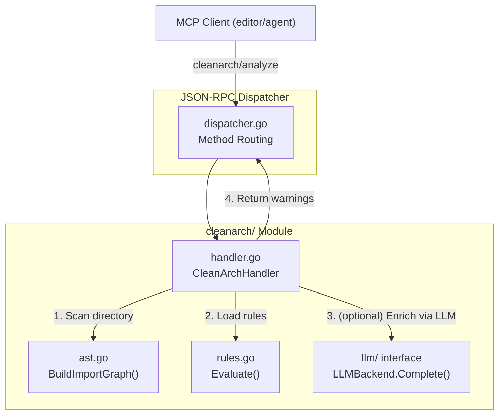
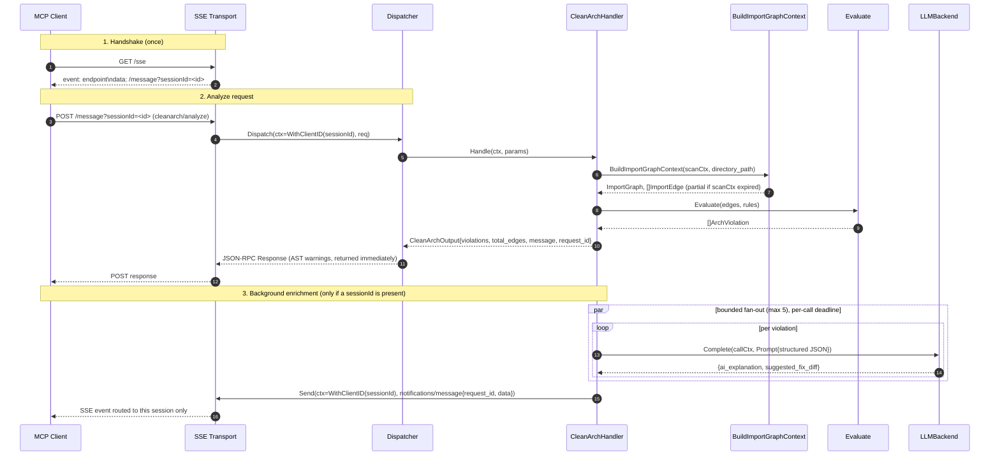

**File:** `.kiro/specs/clean-arch/design.md`
**Module:** `internal/cleanarch/`
**Tool:** `cleanarch/analyze`

# Design Document: Clean-Arch Module

## Overview

The Clean-Arch module is an AI-powered architecture linting tool that performs read-only AST-based analysis of Go source trees. It builds a directed import graph from all `.go` files in a target directory, evaluates each import edge against configurable layer rules, and returns structured violation warnings. When violations are found, the module optionally enriches warnings with human-readable explanations via the shared `LLMBackend` interface.

**Key design goals:**
- Zero false positives from the core rule engine (deterministic glob matching, no heuristics)
- Read-only analysis — never modifies or rewrites source code (mitigates hallucination risk)
- Non-blocking response: `Handle` returns the AST violations immediately; LLM enrichment runs in the background and is streamed back as JSON-RPC notifications (see "Asynchronous Enrichment Delivery")
- Cancellable scan: the AST walk honors a context deadline (default 3s) and returns partial results with a truncation note rather than blocking
- Pluggable rule configuration via YAML with sensible defaults for standard Clean Architecture layers

---

## Architecture



### Sequence Flow

The synchronous path returns the AST findings immediately; enrichment is delivered
asynchronously afterwards, routed to the caller's SSE session.



---

## Components

### 1. Import Graph Builder (`ast.go`)

The AST analyzer uses Go's standard `go/parser` and `go/ast` packages — no external dependencies. It walks all `.go` files (excluding `_test.go` and `vendor/`) within the target directory, parses each file with `parser.ImportsOnly` for performance, and builds:

- **ImportGraph**: `map[string][]string` — a directed graph keyed by relative package path, valued with deduplicated import paths
- **ImportEdge[]**: A flat list of every import statement with `FromFile`, `FromPkg`, `ImportPath`, and `LineNumber`

```go
type ImportGraph map[string][]string

type ImportEdge struct {
    FromFile   string `json:"from_file"`
    FromPkg    string `json:"from_pkg"`
    ImportPath string `json:"import_path"`
    LineNumber int    `json:"line_number"`
}
```

Standard library imports are filtered out using the `isStdLibImport` heuristic (first path segment contains no dot, and the path is not a relative import). This reduces noise since stdlib is always allowed.

### 2. Rules Engine (`rules.go`)

Rules are defined as a list of `Rule` structs with glob-pattern-based `from` (source package) and `to` (target import) fields:

```go
type Rule struct {
    From  string `yaml:"from" json:"from"`
    To    string `yaml:"to" json:"to"`
    Allow bool   `yaml:"allow" json:"allow"`
    Desc  string `yaml:"description" json:"description,omitempty"`
}
```

**Default rules for standard layered architecture:**

| From | To | Allow | Description |
|------|----|-------|-------------|
| `**/domain/**` | `**/infrastructure/**` | false | Domain must not import infrastructure |
| `**/domain/**` | `**/presentation/**` | false | Domain must not import presentation |
| `**/infrastructure/**` | `**/presentation/**` | false | Infrastructure must not import presentation |

The `Evaluate(edges, rules)` function iterates each edge against each rule. Glob matching supports `**` (zero or more segments), `*` (single segment wildcard), and `?` (single character). **Allow rules override deny rules**: if an edge matches an `allow=true` rule first, it is skipped entirely.

### 3. MCP Handler (`handler.go`)

`CleanArchHandler` wires AST analysis → rule evaluation → optional asynchronous LLM enrichment. It follows the project's standard handler pattern:

- Constructor: `NewCleanArchHandler(defaultRules []Rule, llmBackend llm.LLMBackend) *CleanArchHandler` (pass `nil` for `llmBackend` to disable enrichment)
- Notifier wiring: `SetNotifier(n rpc.Notifier)` — typically the transport, set once at startup after it is created
- Handler signature: `Handle(ctx context.Context, params json.RawMessage) (interface{}, error)`
- Registration: `RegisterCleanArch(d *rpc.Dispatcher, handler *CleanArchHandler)`

The scan is bounded by `context.WithTimeout(ctx, scanTimeout)` (default 3s) and uses `BuildImportGraphContext`; if the deadline expires the walk stops early and partial results are returned with a truncation note in `message`.

`Handle` returns the AST violations **immediately** (no inline enrichment). If a client session and an LLM backend are present, it launches background enrichment: one goroutine per violation, bounded by a semaphore (max 5 concurrent) and a per-call deadline (`enrichTimeout`, default 1.5s). Each successful enrichment is pushed to the originating client as a `notifications/message`. Failures, timeouts, and non-JSON responses are logged (`slog.Warn`) and simply produce no notification (graceful degradation).

Guardrail: enrichment runs **only when a session id is present** in the context. Without one there is no delivery target, so enrichment is skipped (never broadcast to unrelated clients) and `message` says so.

### 4. Read-Only Guarantee

The module never calls `os.WriteFile`, `os.Create`, `ioutil.WriteFile`, or any file mutation API. The `BuildImportGraph` function opens files only for reading via `parser.ParseFile`. This is enforced by the Property 12 test (`immutability_test.go`) which checks that file contents are byte-for-byte identical before and after analysis.

### 5. Forbidden APIs (Guardrails)

To guarantee read-only execution and prevent hallucinations, THE AGENT MUST NOT USE the following Go functions in this module:

- `os.WriteFile`, `os.Create`, `os.Mkdir`, `os.MkdirAll`, `os.Remove`, `os.RemoveAll`, `os.Rename`, `os.Truncate`, `os.Chmod`, `os.Chown`
- `ioutil.WriteFile`, `ioutil.TempFile`, `ioutil.TempDir` (deprecated but still importable)
- `exec.Command`, `exec.CommandContext` — no shell commands or subprocesses allowed
- `syscall.Write`, `syscall.Open` — raw syscall file mutation
- `database/sql` or any network client — this module does not connect to databases or external services beyond the LLM interface

All file parsing MUST be done strictly using `go/parser.ParseFile` with `parser.ImportsOnly` mode. The only file operations permitted are `os.Open` and `os.ReadFile` for reading rule YAML files and source code snippets for LLM context.

---

## Data Models

### Tool Input

```go
type CleanArchInput struct {
    DirectoryPath string `json:"directory_path"`             // required: absolute or relative path to the Go module/directory
    RulesFile     string `json:"rules_file,omitempty"`       // optional: path to custom YAML rules file
}
```

### Tool Output

```go
type CleanArchOutput struct {
    Violations []EnrichedViolation `json:"violations"`
    TotalEdges int                 `json:"total_edges"`
    Message    string              `json:"message"`
    // RequestID correlates this response with the asynchronous enrichment
    // notifications it triggers. Empty when no enrichment runs.
    RequestID  string              `json:"request_id,omitempty"`
}

type ArchViolation struct {
    FilePath    string `json:"file_path"`
    LineNumber  int    `json:"line_number"`
    FromPkg     string `json:"from_pkg"`
    Import      string `json:"import"`
    RuleName    string `json:"rule"`
    Description string `json:"description"`
}
```

The immediate response element type is `EnrichedViolation`, but the enrichment
fields are **empty in the synchronous response** — they arrive later via
notifications. The type stays uniform so a client can merge enrichment in place.

```go
type EnrichedViolation struct {
    ArchViolation
    AIExplanation string `json:"ai_explanation,omitempty"`
    SuggestedFix  string `json:"suggested_fix_diff,omitempty"`
    Fallback      bool   `json:"fallback,omitempty"`
}
```

The enrichment is **always advisory** — the `suggested_fix_diff` is a string representation of a potential refactor, never applied to disk.

---

## Asynchronous Enrichment Delivery

AI enrichment is not part of the synchronous response. It is delivered after the
fact as JSON-RPC notifications, routed to the client that made the request. This
keeps `cleanarch/analyze` non-blocking while still providing rich explanations.

### Client handshake (HTTP + SSE transport)

1. The client opens `GET /sse`. The server assigns a random session id and sends
   the MCP `endpoint` event so the client learns where to POST:
   ```
   event: endpoint
   data: /message?sessionId=<id>
   ```
2. The client issues its tool call to `POST /message?sessionId=<id>`. The transport
   stores the `sessionId` on the request context (`rpc.WithClientID`).
3. The synchronous JSON-RPC response returns immediately with the AST violations
   and a `request_id` (present only when enrichment will run).
4. As each violation is enriched, the server sends a notification **to that
   session's SSE stream only**:
   ```json
   {
     "jsonrpc": "2.0",
     "method": "notifications/message",
     "params": {
       "level": "info",
       "logger": "cleanarch/analyze",
       "data": {
         "request_id": "<same as the response>",
         "violation_index": 0,
         "file_path": "...",
         "import": "...",
         "ai_explanation": "...",
         "suggested_fix_diff": "..."
       }
     }
   }
   ```
5. The client correlates notifications with the originating request via `request_id`
   (useful when several analyze calls share one session).

### Routing and the no-session case

- `SSETransport.Send` routes by `rpc.ClientID(ctx)`: a non-empty id delivers to that
  session only; an empty id **broadcasts** to all connected clients (used for other
  server messages, kept backward-compatible).
- To avoid leaking one caller's enrichment to every connected client, the handler
  **skips** enrichment entirely when no `sessionId` is present. In that case the
  response carries no `request_id` and `message` explains that a session is required.
- The `stdio` transport is single-client, so session routing does not apply; its
  `Send` writes to stdout regardless of client id.

### Contract summary

| Condition | Sync response | Notifications |
|---|---|---|
| Session + LLM + violations | violations + `request_id` | one per successfully enriched violation, to that session |
| No session (LLM + violations) | violations, no `request_id`, message says enrichment skipped | none |
| LLM call fails / times out / non-JSON | violations (+ `request_id` if session) | none for the failed violation (logged) |
| No LLM backend | violations | none |

---

## Configuration

```yaml
# ~/.kiroguard.yaml or .kiroguard.yaml in project root
transport:
  type: "sse"
  port: 3000
  auth_token: ""                       # optional single bearer token; empty = endpoints open
  auth_tokens: []                      # optional list of accepted tokens (enables rotation)

cleanarch:
  rules_file: ".cleanarch.yaml"        # optional, defaults to built-in rules
  timeout_ms: 3000                     # AST scan deadline, default 3000
  enrich_timeout_ms: 1500              # per-LLM-call deadline, default 1500
  max_concurrent: 5                    # GLOBAL max concurrent LLM calls, default 5
  max_enrichments_per_request: 25      # per-request enrichment cap, default 25
  metrics_interval_ms: 60000           # periodic metrics report cadence, default 60000
```

---

## Production Hardening

Operational safeguards for running Clean-Arch under real traffic:

- **Global concurrency cap:** LLM enrichment is bounded by a single semaphore shared across *all* in-flight requests (`max_concurrent`, default 5) — not per-request — so a burst of requests cannot fan out into hundreds of simultaneous Bedrock calls.
- **Per-request enrichment cap:** at most `max_enrichments_per_request` (default 25) violations are enriched per request; the rest are still reported, just not AI-explained. Protects cost and tail latency on files with many violations.
- **Graceful drain:** the handler tracks every background enrichment goroutine; `Shutdown(ctx)` waits for them to finish (or force-cancels on deadline). `main.go` calls it after the transport stops so async work isn't cut off mid-flight on SIGTERM.
- **LLM retry with backoff:** the `LLMRouter` retries the primary (Bedrock) on *transient* errors with exponential backoff + jitter (default 3 attempts), respecting the caller's deadline. Timeouts/cancellations are terminal (no retry) and fall through to the heuristic fallback.
- **Endpoint authentication with rotation:** the SSE `/message` and `/sse` endpoints accept a *set* of bearer tokens (`transport.auth_token` + `transport.auth_tokens`), compared in constant time. `SetAuthTokens` swaps the set atomically at runtime, so credentials can be rotated (add new, roll clients over, drop old) without restarting. An empty set keeps endpoints open for local/dev, with a startup warning.
- **Config-driven knobs:** `timeout_ms`, `enrich_timeout_ms`, `max_concurrent`, `max_enrichments_per_request`, and `metrics_interval_ms` are wired from config through functional options (`WithScanTimeout`, `WithEnrichTimeout`, `WithMaxConcurrent`, `WithMaxEnrichmentsPerRequest`).
- **Metrics + periodic export:** atomic counters (`scans_total`, `violations_total`, `enrichments_ok`, `enrichments_failed`) are exposed via `MetricsSnapshot()` and emitted periodically as structured `metrics_report` log events by `StartMetricsReporter(ctx, interval)` (default 60s), ready for CloudWatch metric filters. A final report is flushed on shutdown.

## Correctness Properties

### Property 10: Import graph completeness

*For any* set of Go source files with import declarations, every `import` statement in every file should appear as a directed edge in the dependency graph built by `BuildImportGraph`.

**Validates: REQ-CA-1**

### Property 11: Architecture violation detection correctness

*For any* import graph and rule configuration, a dependency edge `(A → B)` should appear in the violation list if and only if it matches a `deny` rule and is not overridden by an `allow` rule. No false positives, no false negatives.

**Validates: REQ-CA-2**

### Property 12: Source code immutability

*For any* directory analyzed by Clean-Arch, the set of files and their contents should be byte-for-byte identical before and after the analysis run.

**Validates: REQ-CA-3**
