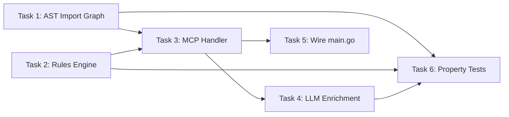

**File:** `.kiro/specs/clean-arch/tasks.md`
**Module:** `internal/cleanarch/`
**Tool:** `cleanarch/analyze`

# Implementation Tasks: Clean-Arch Module

## Overview

This plan builds incrementally: AST scanner first, then rules engine, then MCP handler, then optional LLM enrichment, then property-based tests. Each task references its requirements and produces testable output.

---

## Tasks

### Task 1: Implement AST import graph builder (`ast.go`)

- **Req:** REQ-CA-1
- **Files:** `internal/cleanarch/ast.go`, `internal/cleanarch/ast_test.go`
- **Goal:** Build a complete, accurate import graph from a directory of Go source files.

#### Step-by-step

1. **Create `internal/cleanarch/ast.go`** with:
   - `ImportGraph map[string][]string` type alias
   - `ImportEdge` struct with `FromFile`, `FromPkg`, `ImportPath`, `LineNumber` fields
   - `containsString(slice, s string) bool` helper
   - `isStdLibImport(importPath string) bool` — returns true if first path segment has no dot (and not relative). Include exact tests for: `"fmt"` → true, `"net/http"` → true, `"golang.org/x/tools"` → false, `"github.com/example/lib"` → false, `"./relative"` → false
   - `BuildImportGraph(dir string) (ImportGraph, []ImportEdge, error)` — walk `dir` with `filepath.Walk`, skip `vendor/` dirs and `_test.go` files, parse each `.go` file with `parser.ParseFile(fset, path, nil, parser.ImportsOnly)`, build graph and edges. Standard library imports are excluded from both graph and edges.

2. **Write tests in `ast_test.go`:**
   - `TestBuildImportGraph_MultiplePkgsWithDeps` — create temp dir with `domain/`, `infrastructure/`, `shared/` packages. Verify graph contains all 3 packages, edges count = 3, edge metadata (FromFile, LineNumber) is correct.
   - `TestBuildImportGraph_EmptyDirectory` — empty temp dir → empty graph, empty edges, no error.
   - `TestBuildImportGraph_SkipsTestFiles` — `main.go` (imports external lib) + `main_test.go` (imports test helper) → only `main.go` imports appear in edges.
   - `TestBuildImportGraph_SkipsVendorDir` — file in root + file in `vendor/` → vendor imports excluded from graph and edges.
   - `TestBuildImportGraph_SkipsStdlib` — file with 3 stdlib + 1 external import → only external import in graph.
   - `TestBuildImportGraph_NestedPackages` — `pkg/sub/deep/deep.go` with external import → graph key = `"pkg/sub/deep"`.
   - `TestBuildImportGraph_OnlyTestFilesDir` — dir with only `_test.go` files → empty graph.
   - `TestBuildImportGraph_DuplicateImportsDeduped` — 2 files in same package importing same external lib → graph has 1 entry, edges has 2.
   - `TestParseFileImports` — single file with 2 external imports → returns 2 edges with correct FromPkg/FromFile.
   - `TestBuildImportGraph_NonexistentDir` — `/nonexistent/path` → returns error.

3. **Verify:** `go test -v -count=1 ./internal/cleanarch/ -run 'Test(BuildImportGraph|ParseFileImports|IsStdLibImport)'`

#### Expected Output

```
=== RUN   TestBuildImportGraph_MultiplePkgsWithDeps
--- PASS: TestBuildImportGraph_MultiplePkgsWithDeps (0.01s)
=== RUN   TestBuildImportGraph_EmptyDirectory
--- PASS: TestBuildImportGraph_EmptyDirectory (0.01s)
=== RUN   TestBuildImportGraph_SkipsTestFiles
--- PASS: TestBuildImportGraph_SkipsTestFiles (0.01s)
=== RUN   TestBuildImportGraph_SkipsVendorDir
--- PASS: TestBuildImportGraph_SkipsVendorDir (0.01s)
=== RUN   TestBuildImportGraph_SkipsStdlib
--- PASS: TestBuildImportGraph_SkipsStdlib (0.01s)
=== RUN   TestBuildImportGraph_NestedPackages
--- PASS: TestBuildImportGraph_NestedPackages (0.00s)
=== RUN   TestBuildImportGraph_OnlyTestFilesDir
--- PASS: TestBuildImportGraph_OnlyTestFilesDir (0.00s)
=== RUN   TestBuildImportGraph_DuplicateImportsDeduped
--- PASS: TestBuildImportGraph_DuplicateImportsDeduped (0.00s)
=== RUN   TestParseFileImports
--- PASS: TestParseFileImports (0.00s)
=== RUN   TestBuildImportGraph_NonexistentDir
--- PASS: TestBuildImportGraph_NonexistentDir (0.00s)
=== RUN   TestIsStdLibImport
--- PASS: TestIsStdLibImport (0.00s)
```

---

### Task 2: Implement rules engine (`rules.go`)

- **Req:** REQ-CA-2
- **Files:** `internal/cleanarch/rules.go`, `internal/cleanarch/rules_test.go`
- **Goal:** Load, define, and evaluate architecture rules against import edges.

#### Step-by-step

1. **Create `internal/cleanarch/rules.go`** with:
   - `Rule` struct: `From`, `To`, `Allow`, `Desc` — all exported, with `yaml` and `json` tags
   - `ArchViolation` struct: `FilePath`, `LineNumber`, `FromPkg`, `Import`, `RuleName`, `Description` — all with `json` tags
   - `RulesConfig` struct wrapping `Rules []Rule`
   - `LoadRules(path string) ([]Rule, error)` — read YAML file, unmarshal into RulesConfig
   - `DefaultRules() []Rule` — return 3 standard Clean Architecture deny rules
   - `Evaluate(edges []ImportEdge, rules []Rule) []ArchViolation` — iterate edges × rules; if an edge matches a rule with `allow: true`, break (skip edge); if it matches `allow: false`, record violation and break
   - `matchGlob(pattern, str string) bool` — support `**` (zero+ segments), `*` (single segment), `?` (single char) via recursive matching

2. **Write tests in `rules_test.go`:**
   - `TestDefaultRules` — verify DefaultRules returns exactly 3 rules with correct From/To/Allow/Desc
   - `TestLoadRules` — write valid YAML to temp file, load it, verify 2 rules
   - `TestLoadRules_FileNotFound` — nonexistent path → error
   - `TestLoadRules_InvalidYAML` — malformed YAML → error
   - `TestMatchGlob` — table-driven test covering: exact, `**/domain/**`, `*/domain/*`, `**/infrastructure/**`, `?`, empty string cases
   - `TestEvaluate_ViolationsDetected` — domain→infra + domain→presentation edges → 2 violations
   - `TestEvaluate_NoViolationsForCleanArchitecture` — presentation→domain + infra→domain → 0 violations
   - `TestEvaluate_AllowRuleOverridesDeny` — allow rule for specific infra path appears before general deny → 0 violations
   - `TestEvaluate_DenyRuleWithoutAllow` — deny rule without allow → 1 violation
   - `TestEvaluate_EmptyEdges` — nil edges → 0 violations
   - `TestEvaluate_EmptyRules` — nil rules → 0 violations
   - `TestEvaluate_InfrastructureImportingPresentation` — infra→presentation → 1 violation with correct description

3. **Verify:** `go test -v -count=1 ./internal/cleanarch/ -run 'Test(DefaultRules|LoadRules|MatchGlob|Evaluate)'`

#### Expected Output

All 14+ tests pass.

---

### Task 3: Implement MCP handler (`handler.go`)

- **Req:** REQ-CA-3, REQ-CA-4
- **Files:** `internal/cleanarch/handler.go`, `internal/cleanarch/handler_test.go`
- **Goal:** Wire AST → Rules → MCP response with read-only guarantee.

#### Step-by-step

1. **Create `internal/cleanarch/handler.go`** with:
   - `CleanArchInput` struct: `DirectoryPath` (required), `RulesFile` (optional) — json tags
   - `CleanArchOutput` struct: `Violations`, `TotalEdges`, `Message` — json tags
   - `CleanArchHandler` struct holding `defaultRules []Rule`
   - `NewCleanArchHandler(defaultRules []Rule) *CleanArchHandler` — if nil, use `DefaultRules()`
   - `Handle(ctx, params) (interface{}, error)`:
     1. Unmarshal params into `CleanArchInput`
     2. Validate `DirectoryPath` is not empty → error if so
     3. Load rules: if `RulesFile` is set, call `LoadRules`; otherwise use `defaultRules`
     4. Call `BuildImportGraph(input.DirectoryPath)` to get edges
     5. Call `Evaluate(edges, rules)` to get violations
     6. Return `CleanArchOutput{Violations, TotalEdges, Message}`
   - `RegisterCleanArch(d *rpc.Dispatcher, handler *CleanArchHandler)` — register `"cleanarch/analyze"` method

2. **Write tests in `handler_test.go`:**
   - `TestHandler_ValidAnalysisWithViolations` — create temp project with domain→infra violation → 1 violation with correct fields
   - `TestHandler_ValidAnalysisNoViolations` — presentation→domain + infra→domain → 0 violations
   - `TestHandler_InvalidParams_EmptyDirectory` — empty directory_path → error with message
   - `TestHandler_InvalidParams_MalformedJSON` — malformed params → error
   - `TestHandler_CustomRulesFile` — custom YAML rules + project with violation → 1 violation with custom description
   - `TestHandler_CustomRulesFile_NotFound` — nonexistent rules file → error
   - `TestHandler_NonexistentDirectory` — nonexistent dir → error
   - `TestHandler_EmptyDirectory` — empty dir → 0 violations, 0 edges, no error
   - `TestRegisterCleanArch` — create dispatcher, register handler, dispatch valid request → successful response with non-empty message
   - `TestRegisterCleanArch_UnknownMethod` — dispatch to unknown method → error with CodeMethodNotFound
   - `TestNewCleanArchHandler_NilDefaultRules` — nil input → defaultRules populated (len=3)
   - `TestNewCleanArchHandler_CustomDefaultRules` — custom rules input → those rules stored

3. **Verify:** `go test -v -count=1 ./internal/cleanarch/ -run 'TestHandler|TestRegisterCleanArch|TestNewCleanArchHandler'`

---

### Task 4: Implement LLM enrichment (optional enrichment layer)

- **Req:** REQ-CA-5
- **Files:** Modify `internal/cleanarch/handler.go`, `internal/cleanarch/handler_test.go`
- **Goal:** Enrich violations with LLM-generated explanations when backend is available.

#### Step-by-step

1. **Modify `CleanArchHandler` struct:**
   - Add field `llmBackend llm.LLMBackend` (interface, optional — nil means skip enrichment)
   - Update `NewCleanArchHandler` to accept optional LLM backend
   - `NewCleanArchHandler(defaultRules []Rule, llmBackend llm.LLMBackend) *CleanArchHandler`

2. **Modify `Handle` method:**
   - After evaluating violations, IF `h.llmBackend != nil` AND `len(violations) > 0`:
     - Launch a goroutine for each violation calling `llmBackend.Complete(ctx, prompt)`
     - The prompt includes: file path, rule description, prohibited import, code snippet (read from file)
     - Collect results in a map keyed by violation index
   - Return enriched violations with `AIExplanation` and `SuggestedFix` fields populated when available
   - IF LLM enrichment fails for any violation, return the remaining enrichments — partial results are acceptable

3. **Write tests:**
   - Create a manual mock struct `mockLLMBackend` implementing `llm.LLMBackend` to avoid external dependencies. Do NOT use gomock, testify/mock, or any third-party mocking library — all mocks MUST be hand-written structs in the test file.
   - `TestHandler_WithLLMEnrichment` — the mock returns known text, verify `AIExplanation` is populated
   - `TestHandler_LLMFallbackGraceful` — the mock returns an error, verify violations returned without enrichment (no crash)

4. **Verify:** `go test -v -count=1 ./internal/cleanarch/ -run 'TestHandler.*LLM'`

---

### Task 5: Wire module into main.go

- **Req:** REQ-CA-3
- **File:** `main.go`
- **Goal:** Register Clean-Arch tool so it's available to MCP clients.

#### Step-by-step

1. **In `main.go`, after other module registrations:**
   ```go
   // Clean-Arch: AI-powered architecture linting.
   var defaultRules []cleanarch.Rule
   if _, statErr := os.Stat(cfg.CleanArch.RulesFile); statErr == nil {
       rules, loadErr := cleanarch.LoadRules(cfg.CleanArch.RulesFile)
       if loadErr == nil {
           defaultRules = rules
       }
   }
   archHandler := cleanarch.NewCleanArchHandler(defaultRules)
   cleanarch.RegisterCleanArch(dispatcher, archHandler)
   ```

2. **Verify:**
   - Build: `go build -o /dev/null .`
   - Run with cleanarch scan: `echo '{"jsonrpc":"2.0","id":1,"method":"cleanarch/analyze","params":{"directory_path":"."}}' | go run . 2>/dev/null`
   - Expected: JSON-RPC response with violations array (may be empty for the KiroGuard project itself)

---

### Task 6: Write property-based tests

- **Req:** REQ-CA-1, REQ-CA-2, REQ-CA-4
- **Files:** `internal/cleanarch/ast_pbt_test.go`, `internal/cleanarch/rules_pbt_test.go`, `internal/cleanarch/immutability_test.go`
- **Goal:** Validate universal correctness properties using `pgregory.net/rapid`.

#### Property 10: Import Graph Completeness

```go
// Feature: cleanarch, Property 10: Import graph completeness
// For any generated set of Go source files, every import should appear as an edge.
func TestProperty_ImportGraphCompleteness(t *testing.T) {
    rapid.Check(t, func(t *rapid.T) {
        // Generate random Go files with known imports
        // Verify every import appears in edges and graph
    })
}
```

#### Property 11: Violation Detection Correctness

```go
// Feature: cleanarch, Property 11: Architecture violation detection correctness
// For any graph and rules, violations iff edge matches deny and not overridden by allow.
func TestProperty_ViolationDetectionCorrectness(t *testing.T) {
    rapid.Check(t, func(t *rapid.T) {
        // Generate random edges and rules
        // Verify: no false positives, no false negatives
    })
}
```

#### Property 12: Source Code Immutability

```go
// Feature: cleanarch, Property 12: Source code immutability in Clean-Arch
// File contents are byte-for-byte identical before and after analysis.
func TestProperty_SourceImmutability(t *testing.T) {
    rapid.Check(t, func(t *rapid.T) {
        // Create temp dir with random Go files
        // Record content hashes
        // Run BuildImportGraph
        // Verify all hashes unchanged
    })
}
```

---

## Task Dependency Graph



## Verification Checklist

- [ ] `go test -v -count=1 ./internal/cleanarch/` — all unit tests pass
- [ ] `go test -race -count=1 ./internal/cleanarch/` — no data races
- [ ] `go build ./...` — compiles without errors
- [ ] Manual smoke test: `echo '{"jsonrpc":"2.0","id":1,"method":"cleanarch/analyze","params":{"directory_path":"."}}' | go run . 2>/dev/null` — returns valid JSON-RPC response
- [ ] LLM enrichment: verify `ai_explanation` field appears when Bedrock is available, missing when not
- [ ] Read-only: verify no files in the analyzed directory have modified timestamps after scan
