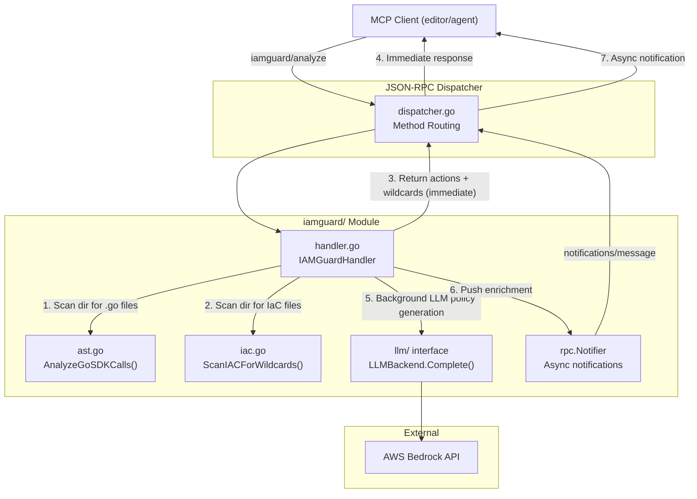
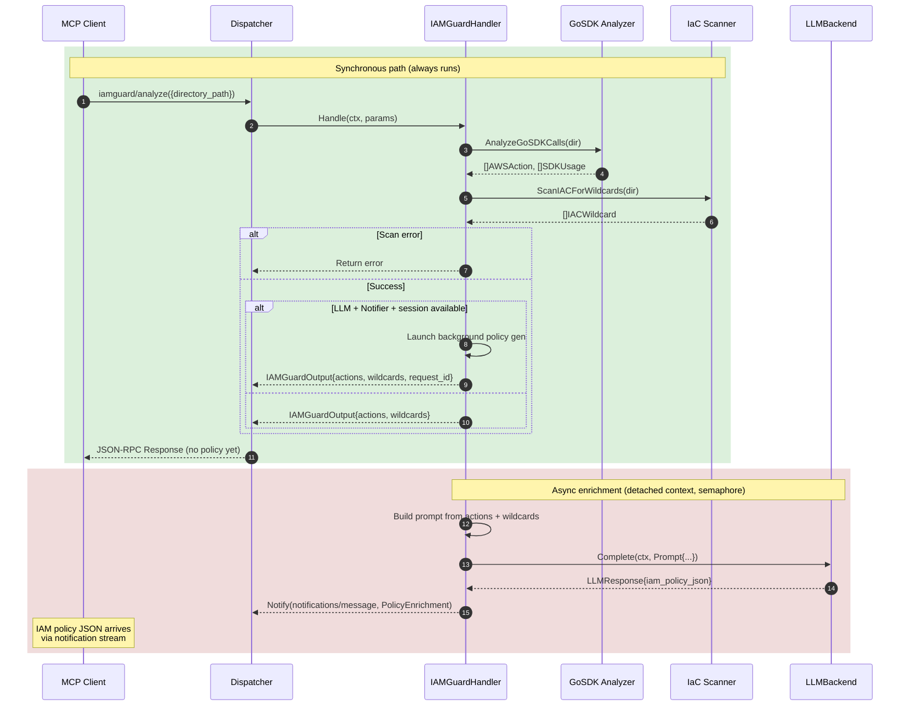

**File:** `.kiro/specs/iamguard/design.md`
**Module:** `internal/iamguard/`
**Tool:** `iamguard/analyze`

# Design Document: IAM-Guard Module (Least Privilege Enforcer)

## Overview

The IAM-Guard module performs read-only, static analysis of Go source code and Infrastructure-as-Code files to detect over-privileged IAM configurations and generate least-privilege IAM policies. It parses Go source trees using `go/parser` to extract AWS SDK v2 client calls, maps each SDK method to its corresponding IAM action, detects `"Action": "*"` and `"Resource": "*"` wildcards in IaC files, and optionally generates a ready-to-use least-privilege IAM policy via the shared `LLMBackend` interface — delivered asynchronously via JSON-RPC notifications (same pattern as Clean-Arch).

**Key design goals:**
- **Same async pattern as Clean-Arch** — `Handle()` returns actions + wildcards immediately; LLM policy generation runs in background goroutines and is pushed via `notifications/message`
- **Least-privilege enforcement** — flags `"Action": "*"` and `"Resource": "*"` in IaC files as "critical" risk
- **Policy-as-code** — generated policy is valid IAM JSON, ready to paste into AWS console, CDK, or Terraform
- **Session-scoped delivery** — enrichment notifications only fire when the request carries an SSE session id (no leak to unrelated clients)
- **Zero AWS credentials required** — analysis is purely local; no live AWS calls

---

## Architecture



### Sequence Flow



---

## Components

### 1. Go SDK Call Analyzer (`ast.go`)

Parses `.go` files using `go/parser` + `go/ast` (same pattern as Clean-Arch) to detect:

- **AWS SDK v2 imports** — any `github.com/aws/aws-sdk-go-v2/service/<svc>` import path
- **Client method calls** — expressions `<clientVar>.<Method>(ctx, ...)` where the variable is assigned via `<svc>.NewFromConfig(cfg)`
- **Service-to-action mapping** — `s3.Client.GetObject` → `s3:GetObject`

```go
type SDKUsage struct {
    FilePath      string `json:"file_path"`
    LineNumber    int    `json:"line_number"`
    ServiceImport string `json:"service_import"`
    Service       string `json:"service"`
    Method        string `json:"method"`
    IAMAction     string `json:"iam_action"`
}

type AWSAction struct {
    Service string `json:"service"`
    Action  string `json:"action"`
    Count   int    `json:"count"`
}
```

**Known limitation:** Only detects local-variable pattern (`client := svc.NewFromConfig(cfg)`). Does not track clients stored as struct fields.

### 2. IaC Wildcard Scanner (`iac.go`)

Scans IaC files for `"Action": "*"` and `"Resource": "*"` statements. Supports JSON, YAML, Terraform, and CDK TypeScript. Individual files larger than 5MB are rejected with a logged warning and skipped.

```go
type IACWildcard struct {
    FilePath   string `json:"file_path"`
    LineNumber int    `json:"line_number"`
    FileType   string `json:"file_type"`
    Statement  string `json:"statement"`
    Risk       string `json:"risk"` // "critical"
}
```

### 3. MCP Handler (`handler.go`)

`IAMGuardHandler` wires Go SDK analyzer → IaC scanner → async LLM policy generation. Follows the **exact same async pattern as Clean-Arch**.

```go
type IAMGuardHandler struct {
    llm      llm.LLMBackend // may be nil; nil skips policy generation
    notifier rpc.Notifier   // may be nil; nil skips async notifications

    baseCtx     context.Context
    baseCancel  context.CancelFunc
    inflight    sync.WaitGroup
    globalSem   chan struct{} // bounds concurrent LLM calls (default 3)

    enrichTimeout time.Duration  // per-LLM-call deadline, default 5s
    scanTimeout   time.Duration  // AST + IaC scan deadline, default 10s

    logger *slog.Logger
}
```

- Constructor: `NewIAMGuardHandler(llmBackend llm.LLMBackend) *IAMGuardHandler` — creates base context, initializes semaphore
- `SetNotifier(n rpc.Notifier)` — called once at startup to wire the transport
- `Shutdown(ctx)` — cancels base context, drains `inflight` WaitGroup (same pattern as Clean-Arch)
- `Handle(ctx, params)`:
  1. Parse + validate `directory_path` (required)
  2. Verify directory exists
  3. Call `AnalyzeGoSDKCalls(dir)` → actions + usages
  4. Call `ScanIACForWildcards(dir)` → wildcards
  5. If `llm != nil && notifier != nil`, detect session via `rpc.ClientID(ctx)`:
     - If session exists → generate `requestID`, launch `startBackgroundPolicyGen()`, include `requestID` in output
     - If no session → return without enrichment (message notes SSE requirement)
  6. Return `IAMGuardOutput` immediately
- Registration: `RegisterIAMGuard(d *rpc.Dispatcher, handler *IAMGuardHandler)`

### 4. LLM Policy Generation — Async Notification Pattern (Clean-Arch)

Follows the exact same pattern as `CleanArchHandler.startBackgroundEnrichment`:

1. `Handle()` returns actions + wildcards **immediately**
2. `startBackgroundPolicyGen(clientID, requestID, actions, wildcards)`:
   - Runs on **detached context** (`h.baseCtx` re-tagged with clientID via `rpc.WithClientID`)
   - Acquires slot from `globalSem` (default 3 concurrent across all in-flight requests)
   - Calls `LLMBackend.Complete(llmCtx, prompt)` with 5s timeout
   - On success, calls `emitPolicy(ctx, requestID, policyJSON, actions)`
   - On failure/timeout, logs warning, silently drops
3. `emitPolicy()` pushes a `notifications/message` MCP notification containing `PolicyEnrichment` payload

**Notification payload:**

```go
type PolicyEnrichment struct {
    RequestID     string `json:"request_id"`
    IAMPolicyJSON string `json:"iam_policy_json"`
    AWSActions    string `json:"aws_actions"`
}
```

Wrapped in the MCP logging shape:
```json
{
  "jsonrpc": "2.0",
  "method": "notifications/message",
  "params": {
    "level": "info",
    "logger": "iamguard/analyze",
    "data": {
      "request_id": "a1b2c3d4",
      "iam_policy_json": "{\"Version\":\"2012-10-17\",...}",
      "aws_actions": "s3:GetObject, s3:PutObject"
    }
  }
}
```

#### 4.1 LLM Prompt Design

- **[Mandatory]** THE prompt SHALL include ONLY: the list of detected IAM actions and wildcard statements. NOT raw source code or AST output.
- **[Mandatory]** THE system prompt SHALL instruct the model to respond ONLY with strict JSON: `{"iam_policy_json": "...", "aws_actions": "..."}`.
- **[Mandatory]** THE system prompt SHALL include: "Never use Resource '*' unless the action inherently requires it (e.g. s3:ListAllMyBuckets)."
- **[Mandatory]** THE prompt SHALL be ≤600 characters.

---

## Data Models

### Tool Input

```go
type IAMGuardInput struct {
    DirectoryPath string `json:"directory_path"`
}
```

### Tool Output

```go
type IAMGuardOutput struct {
    Actions   []AWSAction   `json:"actions"`
    Usages    []SDKUsage    `json:"usages,omitempty"`
    Wildcards []IACWildcard `json:"wildcards,omitempty"`
    Message   string        `json:"message"`
    RequestID string        `json:"request_id,omitempty"`
}
```

---

## Configuration

```yaml
iamguard:
  enrich_timeout_ms: 5000    # per-LLM-call deadline
  scan_timeout_ms: 10000     # AST + IaC scan deadline
  max_file_size_mb: 5        # max IaC file size before skip
```

---

## Production Hardening

- **Scan deadline:** AST + IaC scan respects a configurable deadline (default 10s)
- **Bounded async enrichment:** 1 policy generation per invocation, global semaphore (max 3), 5s per-call deadline
- **Session-scoped delivery:** enrichment runs only when request carries `rpc.ClientID` (SSE only); stdio skips enrichment
- **Read-only:** all operations via `os.ReadFile` + `go/parser` — never writes files
- **5MB file limit:** IaC files exceeding 5MB are skipped with a log warning
- **Metrics:** atomic counters (`scans_total`, `wildcards_total`, `policies_ok`, `policies_failed`)
- **Telemetry:** structured `slog` events tagged `module=iam-guard`

---

## Known Limitations

- **Go only:** SDK analysis only supports Go (aws-sdk-go-v2). Other languages are not supported.
- **Local-variable pattern only:** clients stored as struct fields are not tracked. Demo code MUST use the local-variable pattern.
- **Regex-based IaC scanning:** wildcard detection is line-by-line regex, not a full parser. False positives possible.

---

## Error Handling

| Condition | Response |
|-----------|----------|
| Malformed JSON params | JSON-RPC error `-32602` |
| Empty `directory_path` | JSON-RPC error `-32602`: "directory_path is required" |
| Directory not found | JSON-RPC error `-32602` with path |
| IaC file >5MB | Skip file, log warning, continue |
| LLM policy generation failure | Notification silently dropped — initial response already delivered |

### Forbidden APIs

- `exec.Command`, `exec.CommandContext`
- File mutation APIs (`os.WriteFile`, `os.Create`)
- AWS SDK client init — detection only, never invocation
