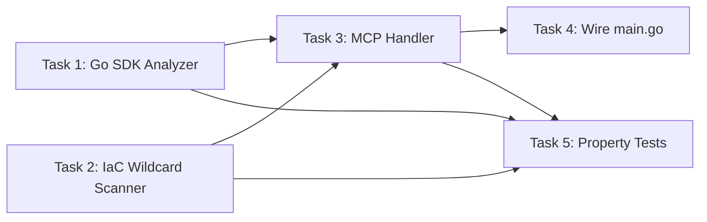

**File:** `.kiro/specs/iamguard/tasks.md`
**Module:** `internal/iamguard/`
**Tool:** `iamguard/analyze`

# Implementation Tasks: IAM-Guard Module

**Alcance de esta spec:** Cubre EXCLUSIVAMENTE `internal/iamguard/`. No modifiques ni analices `internal/cleanarch/`, `internal/vulnscanner/`, `internal/envguard/`, ni `internal/finops/`.

---

## Tasks

### Task 1: Implement Go SDK call analyzer (`ast.go`)

- **Req:** REQ-IG-1
- **Files:** `internal/iamguard/ast.go`, `internal/iamguard/ast_test.go`
- **Goal:** Parse `.go` files to detect AWS SDK v2 imports and client method calls.

#### Step-by-step

1. **Create `internal/iamguard/ast.go`** with:
   - `SDKUsage` struct: `FilePath`, `LineNumber`, `ServiceImport`, `Service`, `Method`, `IAMAction` — json tags
   - `AWSAction` struct: `Service`, `Action`, `Count` — json tags
   - `isAWSSDKImport(path string) (service string, ok bool)` — matches `github.com/aws/aws-sdk-go-v2/service/<svc>`
   - `iamAction(service, method string) string` — returns `<service>:<method>`
   - `AnalyzeGoSDKCalls(dir string) ([]AWSAction, []SDKUsage, error)`:
     1. Walk dir, skip `vendor/`, `_test.go`
     2. Phase 1: `parser.ParseFile` with `parser.ImportsOnly`, find AWS SDK imports
     3. Phase 2: full `ast.Inspect`, track `*ast.AssignStmt` with `<svc>.NewFromConfig(cfg)`, find `<client>.<Method>(ctx, ...)` calls
   - Helpers: `containsString`, `extractPackageName`

2. **Write tests in `ast_test.go`** (use `t.TempDir()` for temp files):
   - `TestIsAWSSDKImport_S3` / `_NonAWS` / `_Core` / `_MultipleServices`
   - `TestIAMAction_Format`
   - `TestAnalyzeGoSDKCalls_SingleService` — `.go` with `s3.GetObject` + `s3.PutObject` → 2 actions, 2 usages
   - `TestAnalyzeGoSDKCalls_MultipleServices` — s3 + dynamodb + sqs → combined
   - `TestAnalyzeGoSDKCalls_NoSDKImports` — stdlib only → empty
   - `TestAnalyzeGoSDKCalls_EmptyDirectory`
   - `TestAnalyzeGoSDKCalls_SkipsTestFiles` / `_SkipsVendorDir`
   - `TestAnalyzeGoSDKCalls_SyntaxErrorSkipsFile`
   - `TestAnalyzeGoSDKCalls_DuplicateCallsDeduped` — 3 call sites for `s3.GetObject` → 1 action count=3
   - `TestAnalyzeGoSDKCalls_NonexistentDir` → error

3. **Verify:** `go test -v -count=1 ./internal/iamguard/ -run 'Test(IsAWS|IAMAction|AnalyzeGoSDK)'`

---

### Task 2: Implement IaC wildcard scanner (`iac.go`)

- **Req:** REQ-IG-2
- **Files:** `internal/iamguard/iac.go`, `internal/iamguard/iac_test.go`
- **Goal:** Scan IaC files for `Action: *` / `Resource: *` with 5MB file size limit.

#### Step-by-step

1. **Create `internal/iamguard/iac.go`** with:
   - `IACWildcard` struct: `FilePath`, `LineNumber`, `FileType`, `Statement`, `Risk` (always `"critical"`)
   - `ScanIACForWildcards(dir string) ([]IACWildcard, error)`:
     - Walk files matching `*.tf`, `*.tf.json`, `*.yaml`, `*.yml`, `*.json`, `*.ts`
     - Skip `vendor/`, `node_modules/`, `.git/`
     - For each matching file: check size via `os.Stat` — if >5MB, log warning and skip
     - Read file, scan line by line for:
       - `Action\s*[:=]\s*"\*"`, `Action\s*[:=]\s*\["\*"\]`
       - `Resource\s*[:=]\s*"\*"`, `Resource\s*[:=]\s*\["\*"\]`
     - Record `IACWildcard` per match
   - `fileTypeFromExt(ext string) string`

2. **Write tests:**
   - `TestScanIACForWildcards_JSONActionStar`
   - `TestScanIACForWildcards_JSONResourceStar`
   - `TestScanIACForWildcards_TerraformActionStar`
   - `TestScanIACForWildcards_TerraformResourceStar`
   - `TestScanIACForWildcards_YAMLActionStar`
   - `TestScanIACForWildcards_NoWildcards`
   - `TestScanIACForWildcards_EmptyDirectory`
   - `TestScanIACForWildcards_SkipsNodeModules`
   - `TestScanIACForWildcards_FileOver5MB` — create file >5MB → skipped, 0 wildcards
   - `TestFileTypeFromExt`

3. **Verify:** `go test -v -count=1 ./internal/iamguard/ -run 'Test(ScanIAC|FileTypeFromExt)'`

---

### Task 3: Implement MCP handler (`handler.go`)

- **Req:** REQ-IG-3, REQ-IG-4, REQ-IG-5
- **Files:** `internal/iamguard/handler.go`, `internal/iamguard/handler_test.go`
- **Goal:** Wire SDK analyzer + IaC scanner + async LLM policy generation with the same pattern as Clean-Arch.

#### Step-by-step

1. **Create `internal/iamguard/handler.go`** with:

   **Types:**
   - `IAMGuardInput`: `DirectoryPath` — json tag
   - `IAMGuardOutput`: `Actions`, `Usages`, `Wildcards`, `Message`, `RequestID` — json tags
   - `PolicyEnrichment`: `RequestID`, `IAMPolicyJSON`, `AWSActions` — json tags (async notification payload)

   **Handler struct:**
   ```go
   type IAMGuardHandler struct {
       llm      llm.LLMBackend
       notifier rpc.Notifier

       baseCtx     context.Context
       baseCancel  context.CancelFunc
       inflight    sync.WaitGroup
       globalSem   chan struct{}

       enrichTimeout time.Duration
       scanTimeout   time.Duration

       logger *slog.Logger
   }
   ```

   **Constructor & lifecycle:**
   - `NewIAMGuardHandler(llmBackend llm.LLMBackend) *IAMGuardHandler`
     - Initialize `baseCtx`/`baseCancel` via `context.WithCancel(context.Background())`
     - `globalSem = make(chan struct{}, 3)`
     - Defaults: `enrichTimeout = 5s`, `scanTimeout = 10s`
   - `SetNotifier(n rpc.Notifier)` — assign `h.notifier`
   - `Shutdown(ctx)` — cancel baseCtx, drain `h.inflight.Wait()`, return ctx.Err() on timeout

   **`Handle(ctx, params)`:**
   1. Unmarshal + validate `directory_path` (required)
   2. `os.Stat` directory → error if not found
   3. `AnalyzeGoSDKCalls(dir)` → actions, usages
   4. `ScanIACForWildcards(dir)` → wildcards
   5. Build message
   6. Detect enrichment eligibility: `h.llm != nil && h.notifier != nil && len(actions) > 0`
   7. If eligible, check `rpc.ClientID(ctx) != ""`:
      - Generate `requestID = newRequestID()`
      - `h.startBackgroundPolicyGen(clientID, requestID, actions, wildcards)`
      - Set `RequestID` in output
   8. Return `IAMGuardOutput` immediately

   **Async enrichment:**
   - `startBackgroundPolicyGen(clientID, requestID string, actions []AWSAction, wildcards []IACWildcard)`:
     - Re-tag base ctx: `rpc.WithClientID(h.baseCtx, clientID)`
     - `h.inflight.Add(1)`
     - Go routine:
       - Defer `h.inflight.Done()`
       - Acquire slot: `h.globalSem <- struct{}{}` / select on `h.baseCtx.Done()`
       - Defer `<-h.globalSem`
       - `callCtx, cancel := context.WithTimeout(clientCtx, h.enrichTimeout)`
       - `resp, err := h.llm.Complete(callCtx, buildPrompt(actions, wildcards))`
       - If err/resp empty/nil → log warning, return
       - Parse structured JSON from response
       - `h.emitPolicy(clientCtx, requestID, policyJSON, actions)`
   - `emitPolicy(ctx, requestID, policyJSON string, actions []AWSAction)`:
     - Build `PolicyEnrichment` payload
     - `h.notifier.Send(ctx, rpc.NewNotification("notifications/message", params))`
   - `buildPrompt(actions, wildcards) llm.Prompt`:
     - System: strict JSON output, forbid `Resource: *`, ≤600 chars total
     - User: list of `service:action` lines + wildcard lines
   - `newRequestID() string` — 8-byte random hex

   **Registration:**
   - `RegisterIAMGuard(d *rpc.Dispatcher, handler *IAMGuardHandler)`

2. **Write tests in `handler_test.go`:**
   - Create hand-written `mockLLMBackend` implementing `llm.LLMBackend`
   - Create hand-written `mockNotifier` with `mu sync.Mutex`, `msgs []*rpc.Response`, thread-safe `count()`/`all()` (same pattern as Clean-Arch)
   - `TestHandle_ValidWithActions` — temp dir with SDK calls → actions list populated
   - `TestHandle_ValidWithWildcards` — temp dir with IaC wildcard → wildcards list populated
   - `TestHandle_MixedSDKAndIaC` — both `.go` calls + IaC wildcards → both populated
   - `TestHandle_NoAWSFound` — stdlib only → empty actions, no error
   - `TestHandle_EmptyDirectoryPath` → error
   - `TestHandle_MalformedJSON` → error
   - `TestHandle_NonexistentDirectory` → error
   - `TestHandle_AsyncPolicyNotification` — mock LLM + mock notifier + `rpc.WithClientID` context → initial response has `request_id`; 1 `PolicyEnrichment` notification captured with valid JSON
   - `TestHandle_AsyncPolicyErrorGraceful` — mock LLM returns error → initial response delivered, 0 notifications
   - `TestHandle_NoNotifierNoEnrichment` — notifier is nil → no request_id, no goroutines
   - `TestHandle_NoSessionIDNoEnrichment` — context without client ID → no enrichment
   - `TestRegisterIAMGuard`
   - `TestNewRequestID_Format` — 16 hex chars
   - `TestShutdown_DrainsInflight`

3. **Verify:** `go test -v -count=1 ./internal/iamguard/ -run 'TestHandle|TestRegister|TestNewRequest|TestShutdown'`

---

### Task 4: Wire module into main.go

- **Req:** REQ-IG-4
- **File:** `main.go`
- **Goal:** Register IAM-Guard tool and wire `SetNotifier`.

#### Step-by-step

1. **In `main.go`, after other registrations:**
   ```go
   import (
       "github.com/luiferdev/kiroguard/internal/iamguard"
   )

   // IAM-Guard: least-privilege IAM policy enforcement.
   iamHandler := iamguard.NewIAMGuardHandler(llmBackend)
   iamguard.RegisterIAMGuard(dispatcher, iamHandler)
   // Wire Notifier for async enrichment.
   if n, ok := transport.(rpc.Notifier); ok {
       iamHandler.SetNotifier(n)
   }
   ```

2. **Verify:**
   - `go build -o /dev/null .`
   - Smoke test on stdio: `echo '{"jsonrpc":"2.0","id":1,"method":"iamguard/analyze","params":{"directory_path":"."}}' | go run . 2>/dev/null`
   - Expected: valid JSON-RPC response with `actions` array (may be empty)

---

### Task 5: Write property-based tests

- **Req:** REQ-IG-1, REQ-IG-2, REQ-IG-3
- **Files:** `internal/iamguard/ast_pbt_test.go`, `internal/iamguard/iac_pbt_test.go`
- **Goal:** Validate universal correctness using `pgregory.net/rapid`.

#### Property 15: SDK Call Detection Completeness

```go
func TestProperty_SDKCallDetectionCompleteness(t *testing.T) {
    rapid.Check(t, func(t *rapid.T) {
        // Generate random Go source with known SDK calls
        // Verify AnalyzeGoSDKCalls returns all of them
    })
}
```

#### Property 16: IAM Action Mapping

```go
func TestProperty_IAMActionMapping(t *testing.T) {
    rapid.Check(t, func(t *rapid.T) {
        // Generate random (service, method) pairs
        // Verify iamAction produces "<service>:<method>"
    })
}
```

#### Property 17: IaC Wildcard Detection

```go
func TestProperty_IaCWildcardDetection(t *testing.T) {
    rapid.Check(t, func(t *rapid.T) {
        // Generate random IaC content with known wildcards
        // Verify ScanIACForWildcards finds all of them
    })
}
```

#### Property 18: LLM Policy Best-Effort

```go
func TestProperty_LLMPolicyBestEffort(t *testing.T) {
    rapid.Check(t, func(t *rapid.T) {
        // Generate random actions, mock LLM fails
        // Verify initial response delivered, no notifications
    })
}
```

---

## Task Dependency Graph



## Verification Checklist

- [x] `go test -v -count=1 ./internal/iamguard/` — 27 tests, all pass
- [x] `go test -race -count=1 ./internal/iamguard/` — no races
- [x] `go build ./...` — compiles
- [x] stdio smoke test — valid JSON-RPC response with `actions` and `message`
- [x] SDK detection — correct IAM actions (`s3:GetObject`, `s3:PutObject`)
- [x] IaC wildcard — `risk="critical"` detected
- [x] Async enrichment via SSE — `request_id` in response, `PolicyEnrichment` in notification stream
- [x] No notifications in stdio mode — correct (no session id)
- [x] Property-based tests — 5 properties x 100 iterations, all pass
- [x] Full project test suite — 15 packages, all pass
