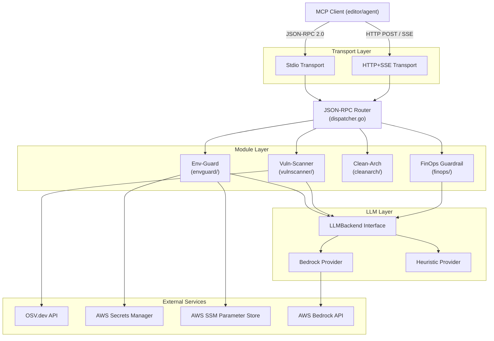

# Design Document: KiroGuard

## Overview

KiroGuard is a Model Context Protocol (MCP) server written in Go that acts as a preventive guard before code reaches production. It exposes four tools — Env-Guard, Vuln-Scanner, Clean-Arch, and FinOps Guardrail — over a JSON-RPC 2.0 transport, allowing MCP-compatible clients to invoke security, vulnerability, architecture, and cost analyses as part of their development workflow.

The system is designed as a monolithic modular binary: a single statically-linked Go binary where each module lives in its own package with a clean interface. Concurrency is achieved with goroutines and channels; the LLM backend is pluggable via a Go interface with AWS Bedrock as the primary provider and a heuristic template engine as the fallback.

**Key design goals:**
- Single binary, zero external runtime dependencies
- Clean module isolation so each guard can be developed and tested independently
- Fast response times: all modules use timeouts and concurrency to avoid blocking
- LLM-agnostic: modules do not call Bedrock directly; they speak to the `LLMBackend` interface

---

## Architecture



### Package Structure

```
kiroguard/
├── main.go                    # Entry point, flag parsing, server start
├── cmd/
│   └── root.go                # CLI flag definitions
├── internal/
│   ├── transport/
│   │   ├── transport.go       # Transport interface
│   │   ├── stdio.go           # Stdio transport implementation
│   │   └── sse.go             # HTTP+SSE transport implementation
│   ├── rpc/
│   │   ├── types.go           # JSON-RPC 2.0 types
│   │   ├── dispatcher.go      # Request routing and handler registry
│   │   └── errors.go          # Standard JSON-RPC error codes
│   ├── llm/
│   │   ├── interface.go       # LLMBackend interface definition
│   │   ├── bedrock.go         # AWS Bedrock provider
│   │   └── heuristic.go       # Template-based heuristic provider
│   ├── envguard/
│   │   ├── scanner.go         # Secret pattern scanning
│   │   ├── migrator.go        # AWS Secrets Manager / SSM migration
│   │   ├── ignore.go          # .envguardignore parser
│   │   └── handler.go         # MCP tool handler
│   ├── vulnscanner/
│   │   ├── parser.go          # npm/pip manifest parsing
│   │   ├── osv.go             # OSV.dev API client
│   │   └── handler.go         # MCP tool handler
│   ├── cleanarch/
│   │   ├── ast.go             # AST-based import graph builder
│   │   ├── rules.go           # Architecture rules engine
│   │   └── handler.go         # MCP tool handler
│   ├── finops/
│   │   ├── detector.go        # Expensive pattern detection
│   │   ├── estimator.go       # Cost estimation formulas
│   │   └── handler.go         # MCP tool handler
│   └── config/
│       ├── config.go          # Configuration struct and loader
│       └── defaults.go        # Default configuration values
└── go.mod
```

---

## Components and Interfaces

### Transport Interface

```go
// internal/transport/transport.go
type Transport interface {
    // Start begins listening and calls handler for each incoming request.
    Start(ctx context.Context, handler MessageHandler) error
    // Send writes a response message back to the connected client.
    Send(ctx context.Context, msg *rpc.Response) error
}

type MessageHandler func(ctx context.Context, req *rpc.Request) (*rpc.Response, error)
```

**Stdio Transport** reads newline-delimited JSON from `os.Stdin` and writes to `os.Stdout`. It runs a single goroutine per connection.

**SSE Transport** starts an `net/http` server. POST `/message` receives JSON-RPC requests; GET `/sse` returns the Server-Sent Events stream. A keep-alive ticker fires every 30 seconds to send a `comment` event (`": keepalive"`).

### JSON-RPC Types

```go
// internal/rpc/types.go
type Request struct {
    JSONRPC string          `json:"jsonrpc"`
    ID      *json.RawMessage `json:"id,omitempty"`
    Method  string          `json:"method"`
    Params  json.RawMessage `json:"params,omitempty"`
}

type Response struct {
    JSONRPC string           `json:"jsonrpc"`
    ID      *json.RawMessage `json:"id,omitempty"`
    Result  json.RawMessage  `json:"result,omitempty"`
    Error   *RPCError        `json:"error,omitempty"`
}

type RPCError struct {
    Code    int         `json:"code"`
    Message string      `json:"message"`
    Data    interface{} `json:"data,omitempty"`
}
```

### Dispatcher

The `Dispatcher` maintains a `map[string]ToolHandler` registry. On each request, it looks up the method, invokes the handler in the same goroutine (handlers are safe to call concurrently), and wraps the result. A `recover()` deferred function in the dispatch loop catches panics and converts them to error responses.

```go
// internal/rpc/dispatcher.go
type ToolHandler func(ctx context.Context, params json.RawMessage) (interface{}, error)

type Dispatcher struct {
    mu       sync.RWMutex
    handlers map[string]ToolHandler
}

func (d *Dispatcher) Register(method string, h ToolHandler)
func (d *Dispatcher) Dispatch(ctx context.Context, req *Request) *Response
```

### LLM Interface

```go
// internal/llm/interface.go
type Prompt struct {
    System string
    User   string
}

type LLMResponse struct {
    Text     string            `json:"text"`
    Metadata map[string]string `json:"metadata"`
}

type LLMBackend interface {
    Complete(ctx context.Context, p Prompt) (*LLMResponse, error)
}
```

**BedrockProvider** uses the `aws-sdk-go-v2/service/bedrockruntime` package to call `InvokeModel` with Claude 3 Sonnet as the default model. The model ID is configurable.

**HeuristicProvider** is a template-based engine using Go's `text/template`. Each module registers named templates for its explanations. No network calls are made.

**LLMRouter** wraps both providers and implements the automatic fallback: it first attempts Bedrock with a 10-second context deadline, and on any error, falls back to HeuristicProvider while setting `metadata["fallback"] = "true"`.

```go
// internal/llm/router.go
type LLMRouter struct {
    primary  LLMBackend
    fallback LLMBackend
}

func (r *LLMRouter) Complete(ctx context.Context, p Prompt) (*LLMResponse, error) {
    timeoutCtx, cancel := context.WithTimeout(ctx, 10*time.Second)
    defer cancel()
    
    resp, err := r.primary.Complete(timeoutCtx, p)
    if err != nil {
        resp, err = r.fallback.Complete(ctx, p)
        if err != nil {
            return nil, err
        }
        resp.Metadata["fallback"] = "true"
    }
    return resp, nil
}
```

### Env-Guard Components

**SecretScanner** applies a set of compiled `regexp.Regexp` patterns against each line of the input diff. Built-in patterns cover:
- AWS access keys (`AKIA[0-9A-Z]{16}`)
- AWS secret keys (40-char alphanumeric after `aws_secret_access_key`)
- Generic API keys (prefixed `key-`, `sk-`, `pk-`, etc.)
- Private key PEM headers
- Database DSNs (postgres, mysql, mongodb URLs)
- JWT tokens (three base64url segments with dots)

**EnvguardIgnoreParser** reads `.envguardignore` line by line. Lines starting with `#` are comments. Other lines are treated as either glob patterns (if they contain `*`, `?`, or `[`) or as literal regex patterns. It compiles all patterns at load time and exposes a single `Match(line string) bool` method.

**SecretMigrator** calls the AWS SDK's `secretsmanager.CreateSecret` or `ssm.PutParameter` to store the detected secret, using the file path and a sanitized version of the secret type as the name. It returns the ARN of the created resource. Timeouts are enforced via `context.WithTimeout(ctx, 10*time.Second)`.

### Vuln-Scanner Components

**ManifestParser** handles two formats:
- `package.json` / `package-lock.json`: parsed as JSON, extracts `dependencies` and `devDependencies`
- `requirements.txt` / `Pipfile.lock`: parsed line by line (format: `package==version`)

**OSVClient** calls `https://api.osv.dev/v1/querybatch` with a batch of `{package: {name, ecosystem}, version}` objects. It deserializes the response into `[]OSVVulnerability` structs. Each vulnerability includes `id`, `severity`, `affected` (version ranges), and `database_specific.fixed_version`.

### Clean-Arch Components

**ASTAnalyzer** uses Go's `go/parser` and `go/ast` packages to walk all `.go` files in the target directory. For each file, it extracts the package path and all import paths. It builds a directed graph where each edge `(importer, importee)` represents an import relationship.

**RulesEngine** loads the Architecture_Rules YAML (or uses defaults). Each rule has a `from` pattern and a `to` pattern, plus an `allow: true/false` flag. The engine evaluates each edge in the import graph against the rules: a violation occurs when an import matches a `deny` rule or fails to match any `allow` rule in a restricted layer.

Default rules for standard layered architecture:
```yaml
rules:
  - from: "domain/**"
    to: "infrastructure/**"
    allow: false
  - from: "domain/**"
    to: "presentation/**"
    allow: false
  - from: "infrastructure/**"
    to: "presentation/**"
    allow: false
```

### FinOps Components

**PatternDetector** analyzes Go source code using `go/ast` for the following patterns:
- **N+1 query loops**: a loop body containing a database call (identified by import path and function name heuristics)
- **Unpaginated DynamoDB scans**: calls to `dynamodb.Scan` or `dynamodb.Query` without a `Limit` field in the input struct
- **Lambda without memory**: an `aws_lambda_function` resource block (in HCL/Terraform context) or a `lambda.CreateFunction` call without `MemorySize`
- **Lambda without timeout**: same call without `Timeout`

**CostEstimator** uses a formula table keyed by pattern type:
```
N+1 Query:           cost = (queries_per_request × req_per_hour × 730) × $0.000001 per DynamoDB read
Unpaginated Scan:    cost = (estimated_items / 1000) × req_per_hour × 730 × $0.00025 per 1000 reads
Lambda no memory:    cost = (512MB default - optimal_mb) × executions_per_month × $0.0000166667
Lambda no timeout:   risk_factor × req_per_hour × 730 × average_lambda_cost
```

---

## Data Models

### Configuration

```go
// internal/config/config.go
type Config struct {
    Transport TransportConfig `yaml:"transport"`
    LLM       LLMConfig       `yaml:"llm"`
    EnvGuard  EnvGuardConfig  `yaml:"envguard"`
    FinOps    FinOpsConfig    `yaml:"finops"`
    CleanArch CleanArchConfig `yaml:"cleanarch"`
}

type TransportConfig struct {
    Type string `yaml:"type"` // "stdio" | "sse"
    Port int    `yaml:"port"` // default: 3000
}

type LLMConfig struct {
    Provider string `yaml:"provider"` // "bedrock" | "heuristic"
    ModelID  string `yaml:"model_id"` // default: "anthropic.claude-3-sonnet-20240229-v1:0"
    Region   string `yaml:"region"`   // default: "us-east-1"
}

type EnvGuardConfig struct {
    IgnoreFile       string `yaml:"ignore_file"`        // default: ".envguardignore"
    MigrationTarget  string `yaml:"migration_target"`   // "secrets_manager" | "ssm"
    SSMPrefix        string `yaml:"ssm_prefix"`         // default: "/kiroguard/"
}

type FinOpsConfig struct {
    DefaultRPH int `yaml:"default_requests_per_hour"` // default: 1000
}

type CleanArchConfig struct {
    RulesFile string `yaml:"rules_file"` // default: ".cleanarch.yaml"
}
```

### Tool Input/Output Models

```go
// Env-Guard tool input
type EnvGuardInput struct {
    Diff     string `json:"diff"`
    FilePath string `json:"file_path,omitempty"` // optional context
}

// Env-Guard finding
type SecretFinding struct {
    LineNumber   int    `json:"line_number"`
    FilePath     string `json:"file_path"`
    SecretType   string `json:"secret_type"`
    Replacement  string `json:"replacement,omitempty"`
    MigratedARN  string `json:"migrated_arn,omitempty"`
    MigrationErr string `json:"migration_error,omitempty"`
}

// Vuln-Scanner tool input
type VulnScannerInput struct {
    Manifest  string `json:"manifest"`          // file content
    Ecosystem string `json:"ecosystem"`          // "npm" | "pip"
}

// Vulnerability finding
type VulnFinding struct {
    CVEID        string   `json:"cve_id"`
    Severity     float64  `json:"severity_score"`
    AffectedRange string  `json:"affected_range"`
    FixedVersion string   `json:"fixed_version"`
    Explanation  string   `json:"explanation,omitempty"`
}

// Clean-Arch tool input
type CleanArchInput struct {
    DirectoryPath string `json:"directory_path"`
}

// Architecture violation finding
type ArchViolation struct {
    FilePath    string `json:"file_path"`
    LineNumber  int    `json:"line_number"`
    Import      string `json:"import"`
    Rule        string `json:"rule"`
    Description string `json:"description"`
}

// FinOps Guardrail tool input
type FinOpsInput struct {
    SourceCode       string `json:"source_code"`
    FilePath         string `json:"file_path"`
    RequestsPerHour  int    `json:"requests_per_hour,omitempty"`
}

// Cost finding
type CostFinding struct {
    PatternType    string  `json:"pattern_type"`
    FilePath       string  `json:"file_path"`
    LineNumber     int     `json:"line_number"`
    EstimatedCost  float64 `json:"estimated_monthly_cost_usd"`
    Explanation    string  `json:"explanation"`
}

// MCP Tool List Response
type Tool struct {
    Name        string      `json:"name"`
    Description string      `json:"description"`
    InputSchema interface{} `json:"inputSchema"`
}
```

### Structured Log Entry

```go
type LogEntry struct {
    Timestamp  time.Time              `json:"timestamp"`
    Level      string                 `json:"level"`
    Module     string                 `json:"module"`
    ErrorType  string                 `json:"error_type,omitempty"`
    Message    string                 `json:"message"`
    StackTrace string                 `json:"stack_trace,omitempty"`
    Fields     map[string]interface{} `json:"fields,omitempty"`
}
```

---

## Correctness Properties

*A property is a characteristic or behavior that should hold true across all valid executions of a system — essentially, a formal statement about what the system should do. Properties serve as the bridge between human-readable specifications and machine-verifiable correctness guarantees.*

### Property 1: JSON-RPC round-trip fidelity

*For any* valid JSON-RPC 2.0 request object, serializing it to JSON and deserializing it back should produce a structurally equivalent request with the same `jsonrpc`, `id`, `method`, and `params` fields.

**Validates: Requirements 1.1, 2.4**

### Property 2: Malformed request produces standard error

*For any* byte sequence that is not valid JSON or lacks required JSON-RPC 2.0 fields (`jsonrpc`, `method`), the JSON_RPC_Handler should return a response with a non-nil `error` field containing code `-32700` (parse error) or `-32600` (invalid request).

**Validates: Requirements 1.3**

### Property 3: Concurrent dispatch safety

*For any* set of N concurrent tool invocations (N ≥ 2), each should receive a response containing the result of its own invocation and no cross-contamination between responses, without data races detectable by the Go race detector.

**Validates: Requirements 1.6**

### Property 4: LLM fallback metadata invariant

*For any* prompt sent to the LLMRouter where the primary Bedrock provider returns an error, the response should contain `metadata["fallback"] == "true"` and the response text should be non-empty (produced by the heuristic provider).

**Validates: Requirements 3.3, 9.2**

### Property 5: Secret detection completeness

*For any* diff string that contains a substring matching a known secret pattern (AWS key, API token, PEM header, database DSN), the Env_Guard scanner should include at least one finding whose `secret_type` matches the category of the embedded secret.

**Validates: Requirements 4.1, 4.2**

### Property 6: Ignore file exclusion

*For any* secret finding that would normally be detected, if the secret's pattern or file path is covered by an entry in the `.envguardignore` file, that finding should be absent from the result set.

**Validates: Requirements 4.5, 4.6**

### Property 7: Secret replacement does not contain the original value

*For any* detected secret value and its migrated ARN, the replacement snippet produced by Env_Guard should contain the ARN reference and should not contain the original secret value as a substring.

**Validates: Requirements 4.4**

### Property 8: Manifest parsing completeness

*For any* valid `package.json` or `requirements.txt` manifest, every dependency entry present in the manifest (with its version constraint) should appear in the list of dependencies returned by the ManifestParser.

**Validates: Requirements 5.1, 5.6**

### Property 9: Vulnerability response structure

*For any* non-empty vulnerability returned by the OSV_Client, the resulting VulnFinding should have non-empty `cve_id`, non-negative `severity_score`, non-empty `affected_range`, and `fixed_version` fields.

**Validates: Requirements 5.3**

### Property 10: Import graph completeness

*For any* set of Go source files with import declarations, every `import` statement in every file should appear as a directed edge in the dependency graph built by the AST_Analyzer.

**Validates: Requirements 6.1**

### Property 11: Architecture violation detection correctness

*For any* import graph and Architecture_Rules configuration, a dependency edge `(A → B)` should appear in the violation list if and only if it matches a `deny` rule in the configuration. No false positives (allowed imports flagged) and no false negatives (denied imports missed).

**Validates: Requirements 6.2, 6.3**

### Property 12: Source code immutability in Clean-Arch

*For any* directory analyzed by Clean_Arch, the set of files and their contents in that directory should be byte-for-byte identical before and after the analysis run.

**Validates: Requirements 6.4**

### Property 13: Cost formula consistency

*For any* expensive pattern type and execution frequency (requests per hour), the estimated monthly cost produced by Cost_Estimator should equal the result of the documented formula for that pattern type applied to the given frequency. The formula must be deterministic: the same inputs always yield the same output.

**Validates: Requirements 7.2**

### Property 14: FinOps finding structure completeness

*For any* detected expensive pattern, the resulting CostFinding should have non-empty `pattern_type`, non-empty `file_path`, positive `line_number`, non-negative `estimated_monthly_cost_usd`, and non-empty `explanation`.

**Validates: Requirements 7.3, 7.6**

### Property 15: External service timeout enforcement

*For any* call to an external service (OSV.dev, AWS Secrets Manager, AWS Bedrock) that takes longer than 10 seconds, the MCP_Server should return an error response containing a timeout indicator within at most 11 seconds of the call being initiated.

**Validates: Requirements 9.3**

### Property 16: Panic recovery and server continuity

*For any* module handler that panics during execution, the MCP_Server should recover the panic, return a JSON-RPC 2.0 response with `error.code == -32603` (Internal Error) for that request, and remain able to successfully process subsequent valid requests.

**Validates: Requirements 9.5, 9.1**

### Property 17: Configuration validation error specificity

*For any* configuration file containing an invalid field (wrong type, out-of-range value, unknown key), the config loader should return an error message that identifies the specific field name that is invalid.

**Validates: Requirements 8.4**

---

## Error Handling

### Error Classification

| Error Source | Strategy | JSON-RPC Code |
|---|---|---|
| Malformed JSON input | Return parse error immediately | -32700 |
| Invalid JSON-RPC structure | Return invalid request error | -32600 |
| Unknown method | Return method not found | -32601 |
| Invalid tool parameters | Return invalid params | -32602 |
| Module internal error | Log + return internal error | -32603 |
| External service timeout | Log + return timeout message | -32603 |
| Module panic | recover() + log + return internal error | -32603 |

### Timeout Budget

Every external call is wrapped with `context.WithTimeout`. The timeout hierarchy is:
- Per external service call: 10 seconds
- Per LLM call (primary): 10 seconds, then falls back to heuristic (no timeout)
- Vuln-Scanner batch: 30 seconds total (covers up to 200 deps at ~150ms per batch call)

### Panic Recovery

The dispatcher wraps each handler invocation in a deferred `recover()`:

```go
func (d *Dispatcher) dispatchSafe(ctx context.Context, req *Request) (resp *Response) {
    defer func() {
        if r := recover(); r != nil {
            stack := debug.Stack()
            log.Error("panic in handler", "method", req.Method, "panic", r, "stack", string(stack))
            resp = errorResponse(req.ID, InternalError, fmt.Sprintf("internal panic: %v", r))
        }
    }()
    return d.dispatch(ctx, req)
}
```

### Structured Logging

KiroGuard uses Go's `log/slog` package (standard library since Go 1.21) for structured logging. All log calls include `module`, `error_type`, and contextual fields. Output is JSON format in production and text format in development (configurable via `--log-format` flag).

---

## Testing Strategy

### Dual Testing Approach

KiroGuard uses both unit tests and property-based tests for comprehensive coverage:

- **Unit tests**: Verify specific examples, edge cases, integration points, and error conditions
- **Property-based tests**: Verify universal properties across generated inputs using [rapid](https://github.com/flyingmutant/rapid) (a Go PBT library with no external dependencies)

### Property-Based Testing Configuration

- Library: `pgregory.net/rapid`
- Minimum iterations per property: 100 (rapid's default is 100 draws)
- Each property test references the design property it validates
- Tag format in test comments: `// Feature: kiroguard, Property N: <property_text>`

### Test Organization

```
internal/
├── rpc/
│   ├── dispatcher_test.go        # Property 2, 3, 16
│   └── types_test.go             # Property 1
├── llm/
│   └── router_test.go            # Property 4
├── envguard/
│   ├── scanner_test.go           # Property 5
│   ├── ignore_test.go            # Property 6
│   └── replacement_test.go       # Property 7
├── vulnscanner/
│   ├── parser_test.go            # Property 8
│   └── findings_test.go          # Property 9
├── cleanarch/
│   ├── ast_test.go               # Property 10
│   ├── rules_test.go             # Property 11
│   └── immutability_test.go      # Property 12
├── finops/
│   ├── estimator_test.go         # Property 13
│   └── findings_test.go          # Property 14
├── transport/
│   └── timeout_test.go           # Property 15
└── config/
    └── config_test.go            # Property 17
```

### Unit Test Focus Areas

- Transport initialization with valid and invalid flags
- MCP `initialize` handshake and tool list response
- LLM provider switching (Bedrock → Heuristic)
- Secret pattern matching for each built-in pattern type
- OSV.dev response deserialization with real API response fixtures
- Architecture rules YAML parsing and default rule application
- FinOps pattern detection with synthetic Go code snippets
- CLI flag defaults and config file loading

### Integration Test Scope

- End-to-end Vuln-Scanner with mocked OSV.dev server
- End-to-end Env-Guard with mocked AWS SDK
- SSE transport keep-alive verification
- Single binary build verification (smoke test)
