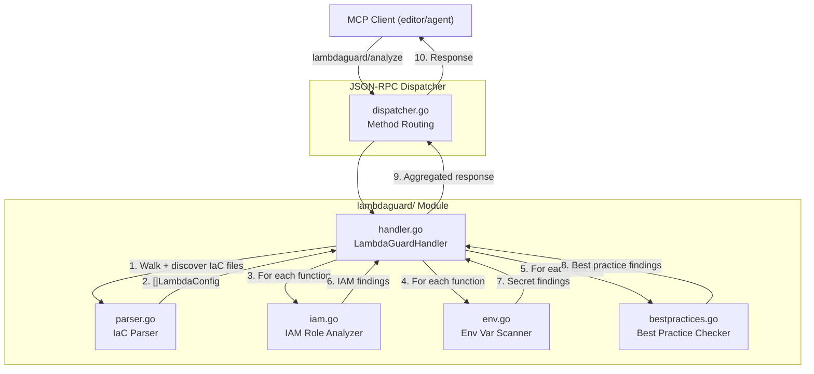
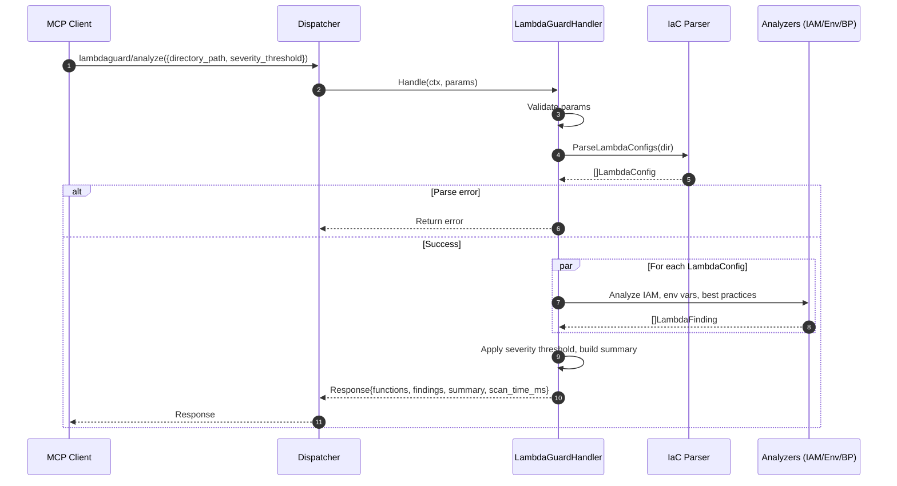

**File:** `.kiro/specs/lambdaguard/design.md`
**Module:** `internal/lambdaguard/`
**Tool:** `lambdaguard/analyze`

# Design Document: LambdaGuard Module (Serverless Security Analyzer)

## Overview

The LambdaGuard module performs read-only static analysis of Infrastructure-as-Code files to detect security, cost, reliability, operations, and performance issues in AWS Lambda function configurations. It parses SAM, Serverless Framework, Terraform, and CDK files to extract Lambda function definitions, then applies a suite of 12 best-practice checks along with IAM over-privilege detection and environment variable secret scanning.

**Key design goals:**
- **Multi-format IaC support** — SAM, Serverless Framework, Terraform, CDK (heuristic)
- **Zero AWS credentials required** — analysis is purely local file parsing
- **Categorised findings** — each finding tagged with `security`, `cost`, `operations`, `reliability`, or `performance`
- **Severity-aware filtering** — clients set a minimum severity threshold
- **Same async enrichment pattern as IAM-Guard** — (future) optional LLM remediation suggestions
- **Read-only guarantee** — never modifies or writes files

---

## Architecture



### Sequence Flow



### Module Structure

```
internal/lambdaguard/
├── handler.go           # LambdaGuardHandler: validation, orchestration, metrics
├── handler_test.go
├── parser.go            # IaC parser: SAM, Serverless, Terraform, CDK heuristic
├── parser_test.go
├── iam.go               # IAM role analyzer (wildcard detection + managed policy flag)
├── iam_test.go
├── env.go               # Environment variable secret scanner (reuses patterns)
├── env_test.go
├── bestpractices.go     # 12 best-practice checks
├── bestpractices_test.go
└── types.go             # LambdaConfig, LambdaFinding, Summary, Metrics
```

---

## Data Model

### LambdaConfig

```go
type LambdaConfig struct {
    FunctionName       string            `json:"function_name"`
    SourceFile         string            `json:"source_file"`
    Runtime            string            `json:"runtime"`
    Timeout            int               `json:"timeout"`
    MemorySize         int               `json:"memory_size"`
    RoleARN            string            `json:"role_arn,omitempty"`
    RoleStatements     []IAMStatement    `json:"role_statements,omitempty"`
    Environment        map[string]string `json:"environment,omitempty"`
    DLQTarget          string            `json:"dlq_target,omitempty"`
    VPCConfig          *VPCConfig        `json:"vpc_config,omitempty"`
    ReservedConcurrency int              `json:"reserved_concurrency"`
    TracingMode        string            `json:"tracing_mode,omitempty"`
    Architectures      []string          `json:"architectures,omitempty"`
    Handler            string            `json:"handler,omitempty"`
    Description        string            `json:"description,omitempty"`
    IaCFormat          string            `json:"iac_format"` // sam | serverless | terraform | cdk
}
```

### LambdaFinding

```go
type LambdaFinding struct {
    FunctionName string `json:"function_name"`
    SourceFile   string `json:"source_file"`
    CheckID      string `json:"check_id"`       // LG-1 through LG-12 or SECRET or IAM_WILDCARD
    Severity     string `json:"severity"`        // low | medium | high | critical
    Category     string `json:"category"`        // security | cost | operations | reliability | performance
    Message      string `json:"message"`         // human-readable description
    Remediation  string `json:"remediation"`      // suggestion for fixing
    CurrentValue string `json:"current_value,omitempty"` // the value that triggered the finding
}
```

### Summary

```go
type Summary struct {
    TotalFunctions   int            `json:"total_functions"`
    TotalFindings    int            `json:"total_findings"`
    BySeverity       map[string]int `json:"by_severity"`
    ByCategory       map[string]int `json:"by_category"`
    ScanTimeMs       int64          `json:"scan_time_ms"`
    FilesScanned     int            `json:"files_scanned"`
}
```

### IAMStatement

```go
type IAMStatement struct {
    Effect   string   `json:"effect"`
    Action   []string `json:"action"`
    Resource []string `json:"resource"`
}
```

### VPCConfig

```go
type VPCConfig struct {
    SubnetIDs        []string `json:"subnet_ids"`
    SecurityGroupIDs []string `json:"security_group_ids"`
}
```

---

## Analyzer Design

### IaC Parser (`parser.go`)

- **SAM**: Unmarshal YAML, traverse `Resources.*` where `Type == "AWS::Serverless::Function"`, extract `Properties`
- **Serverless Framework**: Unmarshal YAML, iterate `functions.*`, extract `handler`, `events`, `environment`, `iamRoleStatements`
- **Terraform**: Use regex-based extraction of `resource "aws_lambda_function" "..." { ... }` blocks with nested attribute parsing
- **CDK heuristic**: Scan `.ts`/`.js` for `new lambda.Function(` or `new Function(` calls, extract arguments via regex

Each parser returns `[]LambdaConfig` with consistent field mapping across formats.

### IAM Role Analyzer (`iam.go`)

- Parse inline `Policies` statements in SAM `AWS::Serverless::Function` `Policies` property
- Detect wildcard actions (`"*"`) and resources (`"*"`) → critical finding
- Flag managed policy ARNs → medium finding (security category)
- No live API calls — analysis is purely local

### Environment Variable Scanner (`env.go`)

- Copy-paste of PII-Guard pattern matching applied to `LambdaConfig.Environment` values
- Skip values matching `{{resolve:secretsmanager:...}}` or CloudFormation dynamic references
- Redact matched values to `****` in findings
- Apply entropy detection for values > 20 chars with entropy ≥ 4.5

### Best Practice Checker (`bestpractices.go`)

Each check is a function `func(cfg *LambdaConfig) *LambdaFinding` registered in a `var Checks = []Check{...}` slice. Checks are evaluated in order, and each returns either `nil` (pass) or a `*LambdaFinding`.

---

## Metrics

```go
type Metrics struct {
    AnalyzesTotal      atomic.Int64
    FunctionsTotal     atomic.Int64
    FindingsTotal      atomic.Int64
    CriticalFindings   atomic.Int64
}
```

Exported periodically via `StartMetricsReporter` with `metrics_report` log events tagged `module=lambda-guard`.

---

## Config

New section in `config.yaml`:

```yaml
lambdaguard:
  severity_threshold: low         # default report level
  max_file_size_mb: 5             # max IaC file to parse
  scan_timeout_ms: 15000          # full scan deadline
  metrics_interval_ms: 60000      # metrics report cadence
```
