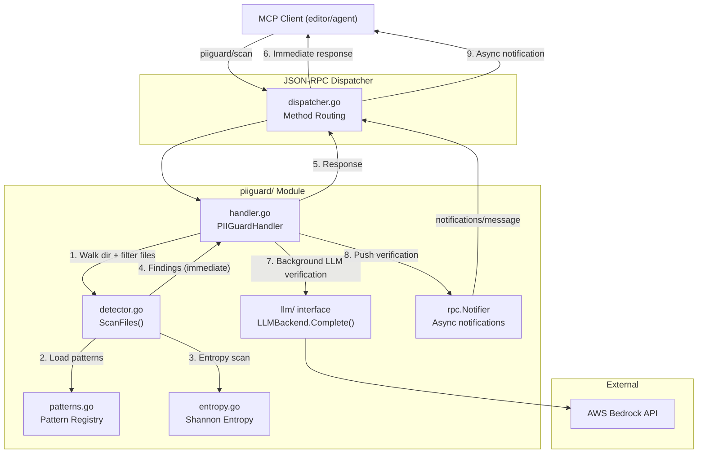
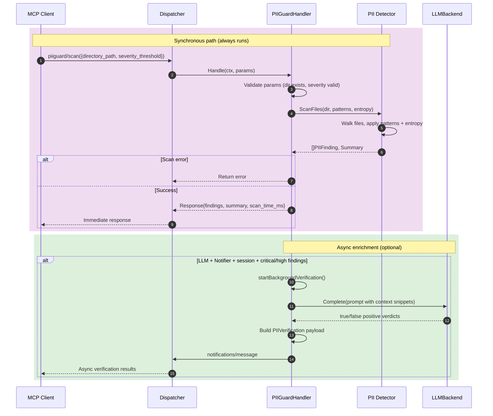

**File:** `.kiro/specs/pii-guard/design.md`
**Module:** `internal/piiguard/`
**Tool:** `piiguard/scan`

# Design Document: PII-Guard Module (Privacy & Compliance Scanner)

## Overview

The PII-Guard module performs read-only static analysis of source code and configuration files to detect exposed Personally Identifiable Information (PII), secrets, and credentials. It combines regex-based pattern matching with Shannon entropy analysis to identify potential leaks, then optionally delegates ambiguous findings to the shared `LLMBackend` for async verification.

**Key design goals:**
- **Multi-layer detection** — named regex patterns for known PII types + entropy heuristics for unknown secrets
- **Enterprise-grade patterns** — Luhn checksum for credit cards, PEM boundary detection, JWT validation
- **Same async enrichment pattern as IAM-Guard** — `Handle()` returns findings immediately; LLM verification runs in background goroutines and is pushed via `notifications/message`
- **Severity-aware filtering** — clients can set a `severity_threshold` to ignore low-severity noise
- **Zero false positive on test code** — test files are excluded by convention, comment-only lines are excluded
- **Zero data exfiltration** — never sends raw file contents to LLM; only 50-char context snippets around matches

---

## Architecture



### Sequence Flow



### Module Structure

```
internal/piiguard/
├── handler.go          # PIIGuardHandler: validation, metrics, orchestration
├── handler_test.go
├── detector.go         # ScanFiles: file walking, pattern matching, dedup
├── detector_test.go
├── patterns.go         # PIIPattern registry, built-in pattern definitions
├── patterns_test.go
├── entropy.go          # Shannon entropy calculator
├── entropy_test.go
└── types.go            # PIIFinding, Summary, VerificationResult types
```

---

## Data Model

### PIIFinding

```go
type PIIFinding struct {
    FilePath    string `json:"file_path"`
    LineNumber  int    `json:"line_number"`
    PatternType string `json:"pattern_type"` // email, credit_card, ssn, etc.
    Severity    string `json:"severity"`     // low, medium, high, critical
    MatchSample string `json:"match_sample"` // first 40 chars of match (redacted middle)
    Context     string `json:"context"`      // ~50 chars before match
}
```

### Summary

```go
type Summary struct {
    TotalFindings  int            `json:"total_findings"`
    BySeverity     map[string]int `json:"by_severity"`     // "critical": 3, "high": 5
    ByPatternType  map[string]int `json:"by_pattern_type"` // "email": 12, "aws_key": 1
    ScanTimeMs     int64          `json:"scan_time_ms"`
    FilesScanned   int            `json:"files_scanned"`
    FilesSkipped   int            `json:"files_skipped"`
}
```

### VerificationResult (async notification)

```go
type VerificationResult struct {
    RequestID    string                 `json:"request_id"`
    Verdicts     []FindingVerdict       `json:"verdicts"`
    GeneratedAt  string                 `json:"generated_at"`
}

type FindingVerdict struct {
    FilePath      string `json:"file_path"`
    LineNumber    int    `json:"line_number"`
    PatternType   string `json:"pattern_type"`
    IsTruePositive bool  `json:"is_true_positive"`
    LLMReason     string `json:"llm_reason,omitempty"`
}
```

---

## Pattern Registry

Patterns are defined in `patterns.go` as a `var BuiltinPatterns = []PIIPattern{...}`. Each pattern has:

```go
type PIIPattern struct {
    Name        string
    Severity    string
    Category    string // "pii" | "credential" | "secret" | "infra"
    Regex       *regexp.Regexp
    Description string
}
```

Built-in patterns (14):

| Name | Severity | Category | Description |
|------|----------|----------|-------------|
| `email` | low | pii | RFC 5322 simplified |
| `phone` | low | pii | E.164 + common formats |
| `credit_card` | critical | pii | Luhn-validated (Visa/MC/Amex/Discover) |
| `ssn` | high | pii | US SSN format |
| `aws_access_key` | critical | credential | `AKIA` + 16 alphanumeric |
| `aws_secret_key` | critical | credential | 40-char Base64-like |
| `github_token` | critical | credential | `ghp_`, `gho_`, `ghu_`, `ghs_`, `ghr_` |
| `generic_api_key` | high | secret | `api_key`, `apikey`, `token`, `secret` |
| `password_field` | critical | credential | `password`/`passwd`/`pwd` assignment |
| `private_key` | critical | secret | PEM private key header |
| `jwt_token` | high | secret | JWT 3-part base64 |
| `ip_address` | medium | infra | Private IPv4 ranges |
| `connection_string` | critical | credential | JDBC/ODBC with credentials |
| `high_entropy_string` | medium | secret | Shannon ≥ 4.5 |

---

## Metrics

Same pattern as IAM-Guard:

```go
type Metrics struct {
    ScansTotal       atomic.Int64
    FindingsTotal    atomic.Int64
    CriticalFindings atomic.Int64
    VerificationsOK  atomic.Int64
    VerificationsFailed atomic.Int64
}
```

Exported periodically via `StartMetricsReporter` with `metrics_report` log events tagged `module=pii-guard`.

---

## Config

New section in `config.yaml`:

```yaml
piiguard:
  severity_threshold: low        # default report level
  max_file_size_mb: 2            # max file to scan (default 2)
  entropy_threshold: 4.5          # Shannon entropy cutoff (default 4.5)
  enrich_timeout_ms: 5000         # per-LLM-call deadline
  scan_timeout_ms: 15000          # full scan deadline
  max_concurrent: 3               # max concurrent LLM calls
  metrics_interval_ms: 60000      # metrics report cadence
```
