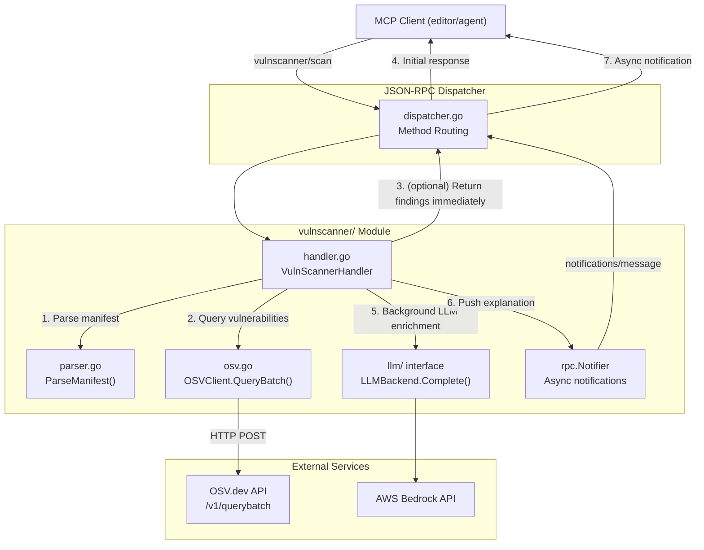
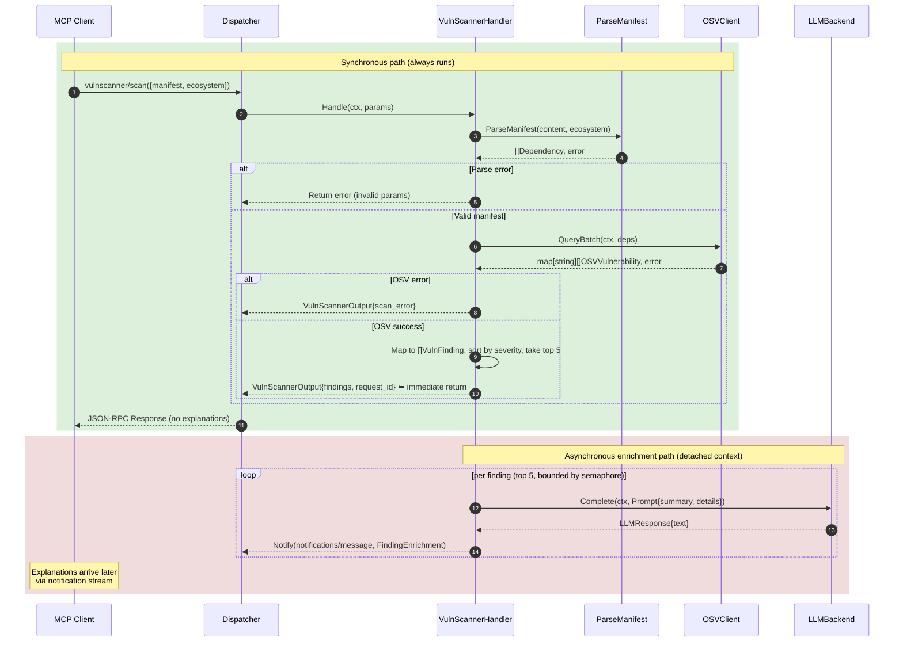

**File:** `.kiro/specs/vulnscanner/design.md`
**Module:** `internal/vulnscanner/`
**Tool:** `vulnscanner/scan`

# Design Document: Vuln-Scanner Module

## Overview

The Vuln-Scanner module scans dependency manifests (npm and pip) against the [OSV.dev](https://osv.dev) open-source vulnerability database. It parses package manifests to extract dependency names and versions, queries OSV.dev's batch API for known vulnerabilities, maps each CVE/GHSA entry into a structured finding, and optionally enriches findings with human-readable explanations via the shared `LLMBackend` interface.

**Key design goals:**
- Zero API key required — OSV.dev is free and public
- Batch querying for performance — all dependencies in a single HTTP request
- Graceful degradation — OSV outage returns partial results with `scan_error`, not a hard failure
- LLM enrichment is best-effort — never blocks the response or fails the scan
- Support both `npm` (package.json, package-lock.json v1/v2/v3) and `pip` (requirements.txt) ecosystems

---

## Architecture



### Sequence Flow



---

## Components

### 1. Manifest Parser (`parser.go`)

Parses dependency manifests into a uniform `[]Dependency` slice. Supports two ecosystems:

**npm (`ecosystem: "npm"`)**:
- `package.json` — extracts `dependencies` and `devDependencies` maps, strips semver prefixes (`^`, `~`, `>=`, etc.)
- `package-lock.json` v3 — parses the `packages` map keyed by `node_modules/<name>`
- `package-lock.json` v1/v2 — parses the legacy `dependencies` map with version objects

**pip (`ecosystem: "pip"`)**:
- `requirements.txt` — line-by-line parsing, supports `==`, `>=`, `<=`, `!=`, `~=` operators
- Skips blank lines, comments (`#`), inline comments, and flag lines starting with `-`

```go
type Dependency struct {
    Name      string `json:"name"`
    Version   string `json:"version"`
    Ecosystem string `json:"ecosystem"` // "npm" or "pypi"
}
```

### 2. OSV.dev Client (`osv.go`)

Queries the [OSV.dev batch API](https://google.github.io/osv.dev/post-v1-querybatch/) with all dependencies in a single HTTP POST request. Enforces a 30-second total timeout.

```go
type OSVClient struct {
    httpClient *http.Client
    baseURL    string
}
```

**Request format:**
```json
{
  "queries": [
    {"package": {"name": "lodash", "ecosystem": "npm"}, "version": "4.17.20"},
    {"package": {"name": "express", "ecosystem": "npm"}, "version": "4.18.2"}
  ]
}
```

**Response mapping:**
- `OSVVulnerability.ID` → `VulnFinding.CVEID` (CVE or GHSA identifier)
- `OSVVulnerability.Severity` → `VulnFinding.Severity` (numeric CVSS score heuristic)
- `OSVVulnerability.Affected[].Ranges[].Events` → `VulnFinding.AffectedRange` + `VulnFinding.FixedVersion`
- Results map back to dependencies by index position in the batch response

### 3. MCP Handler (`handler.go`)

`VulnScannerHandler` wires manifest parsing → OSV query → (optional) async LLM enrichment. Follows the project's standard handler pattern:

```go
type VulnScannerHandler struct {
    osvClient *OSVClient
    llm       llm.LLMBackend // may be nil; nil skips enrichment
    notifier  rpc.Notifier   // may be nil; nil skips async notifications

    baseCtx     context.Context
    baseCancel  context.CancelFunc
    inflight    sync.WaitGroup
    globalSem   chan struct{} // bounds concurrent LLM calls

    enrichTimeout time.Duration
    maxPerRequest int // max findings enriched per request

    logger *slog.Logger
}
```

- Constructor: `NewVulnScannerHandler(osvClient *OSVClient, llmBackend llm.LLMBackend) *VulnScannerHandler`
- SetNotifier: `SetNotifier(n rpc.Notifier)` — called at startup to wire the transport
- Handler signature: `Handle(ctx context.Context, params json.RawMessage) (interface{}, error)`
- Registration: `RegisterVulnScanner(d *rpc.Dispatcher, handler *VulnScannerHandler)`

**Error resilience:**
- OSV API failures do NOT fail the scan — `ScanError` field is set, findings are returned empty
- LLM enrichment failures do NOT fail the scan — explanations stay empty
- Malformed manifests return a proper JSON-RPC invalid params error

### 4. LLM Enrichment — Async Notification Pattern

Enrichment follows the **same async notification pattern** as the Clean-Arch module: findings are returned to the client immediately (no blocking on Bedrock), and each enriched explanation is pushed via a JSON-RPC `notifications/message` notification.

**Flow:**

1. `Handle()` maps OSV results to `[]VulnFinding`, sorts by `severity_score` descending, takes the top `maxPerRequest` (default: 5)
2. Returns `VulnScannerOutput{findings, request_id}` **immediately** — all `explanation` fields are empty in the initial response
3. If `llm != nil && notifier != nil`, launches `startBackgroundEnrichment()` in goroutines on a **detached context** (the request context is already done)
4. Each goroutine acquires a slot from `globalSem` (max 5 concurrent across all in-flight requests), calls `LLMBackend.Complete()`, and pushes the result via `notifier.Send()` as a `notifications/message` notification
5. The response's `request_id` allows the client to correlate incoming notifications with the original request

**Notification payload:**

```go
type FindingEnrichment struct {
    RequestID     string `json:"request_id"`
    FindingIndex  int    `json:"finding_index"`
    PackageName   string `json:"package_name"`
    CVEID         string `json:"cve_id"`
    AIExplanation string `json:"ai_explanation"`
}
```

The notification is wrapped in the `notifications/message` MCP logging shape:
```json
{
  "jsonrpc": "2.0",
  "method": "notifications/message",
  "params": {
    "level": "info",
    "logger": "vulnscanner/scan",
    "data": {
      "request_id": "a1b2c3d4",
      "finding_index": 0,
      "package_name": "lodash",
      "cve_id": "CVE-2024-1234",
      "ai_explanation": "Prototype pollution vulnerability..."
    }
  }
}

#### 4.1 LLM Prompt Design (Token Optimization)

The OSV.dev API response for a single CVE can contain an `affected[].versions` array with thousands of entries, consuming >10K tokens if sent raw to Bedrock. To minimize cost and latency:

- **[Mandatory]** THE prompt builder SHALL extract ONLY the following fields from the OSV vulnerability object: `ID`, `summary`, `details`, and `aliases`. These are typically <200 characters combined.
- **[Mandatory]** THE prompt builder SHALL NOT include `affected[].ranges`, `affected[].versions`, `affected[].database_specific`, or any raw JSON fragments from the OSV response.
- **[Mandatory]** THE prompt SHALL be ≤500 characters (system + user combined). If the summary/details text exceeds this, truncate to 400 characters and append `"..."`.

This ensures each LLM call consumes approximately 100-150 tokens (prompt + response), keeping Bedrock cost per scan under $0.001.

---

## Data Models

### Tool Input

```go
type VulnScannerInput struct {
    Manifest  string `json:"manifest"`  // required: raw content of the manifest file
    Ecosystem string `json:"ecosystem"` // required: "npm" | "pip"
}
```

### Tool Output

```go
type VulnScannerOutput struct {
    Findings  []VulnFinding `json:"findings"`
    TotalDeps int           `json:"total_deps"`
    VulnCount int           `json:"vuln_count"`
    ScanError string        `json:"scan_error,omitempty"`
    RequestID string        `json:"request_id,omitempty"` // correlates async enrichment notifications
}

type VulnFinding struct {
    PackageName   string  `json:"package_name"`
    CVEID         string  `json:"cve_id"`
    Severity      float64 `json:"severity_score"`
    AffectedRange string  `json:"affected_range"`
    FixedVersion  string  `json:"fixed_version"`
    Explanation   string  `json:"explanation,omitempty"`
}
```

---

## Configuration

```yaml
# ~/.kiroguard.yaml or .kiroguard.yaml in project root
vulnscanner:
  enrich_timeout_ms: 1500              # per-LLM-call deadline, default 1500
  max_concurrent: 5                    # GLOBAL max concurrent LLM calls, default 5
  max_enrichments_per_request: 5       # per-request enrichment cap, default 5
  metrics_interval_ms: 60000           # periodic metrics report cadence, default 60000
```

OSV.dev is free and needs no API key; all knobs have sensible defaults, so the
module works out-of-the-box. The knobs above are wired through functional options
(`WithEnrichTimeout`, `WithMaxConcurrent`, `WithMaxPerRequest`).

---

## Production Hardening

Operational safeguards that bring Vuln-Scanner to parity with Clean-Arch and Env-Guard:

- **OSV batch + detail hydration:** `/v1/querybatch` returns only vuln ids, so each
  minimal vuln is hydrated via `GET /v1/vulns/{id}` concurrently (bounded to 10)
  writing into distinct slice indices (no data races). A failed hydration keeps the
  minimal vuln (id still reported) and logs `hydration_failed`.
- **Transient-failure retry:** OSV HTTP calls retry on 429/5xx/network errors with
  exponential backoff + jitter (default 3 attempts), respecting the context deadline.
  Timeouts/cancellations and non-retryable 4xx are terminal.
- **Bounded async enrichment:** findings return immediately; the top-5 by severity are
  enriched in background goroutines under a GLOBAL semaphore (max 5) with a 1.5s
  per-call deadline. `Shutdown()` drains in-flight goroutines.
- **Session-scoped delivery (no leak):** enrichment runs only when the request carries
  a client session id (`rpc.ClientID`); without a session there is no delivery target,
  so enrichment is skipped instead of broadcasting to unrelated clients. (Consequence:
  stdio, which has no session, does not receive enrichment notifications.)
- **Metrics:** atomic counters (`scans_total`, `vulns_found_total`, `enrichments_ok`,
  `enrichments_failed`) via `MetricsSnapshot()`, exported periodically as
  `metrics_report` logs by `StartMetricsReporter` (CloudWatch-native).
- **Telemetry:** structured `slog` events (`scan_started`, `scan_completed`,
  `enrichment_dropped`, `osv_retry`, `hydration_failed`) tagged `module=vuln-scanner`.

---

## Correctness Properties

### Property 8: Manifest parsing completeness

*For any* valid `package.json` or `requirements.txt` manifest, every dependency entry present in the manifest (with its version constraint) should appear in the list of dependencies returned by `ParseManifest`. Stdlib and test-only modifiers (devDependencies) are included.

**Validates: REQ-VS-1**

### Property 9: Vulnerability response structure

*For any* non-empty vulnerability returned by the OSVClient, the resulting `VulnFinding` should have non-empty `CVEID`, non-negative `Severity`, and the `AffectedRange`/`FixedVersion` fields should reflect the version range events from the OSV response.

**Validates: REQ-VS-3**

### Property 13: OSV error resilience

*For any* OSV API failure (network error, non-200 status, timeout), the handler should return a `VulnScannerOutput` with `ScanError` populated and an empty `Findings` slice — never a hard JSON-RPC error.

**Validates: REQ-VS-4**

### Property 14: LLM enrichment best-effort (async)

*For any* LLM backend error (timeout, service unavailable), the handler should return findings immediately without explanations. The enrichment notification is silently dropped — the initial response was already delivered and must not be re-sent.

**Validates: REQ-VS-5**

---

---

## CVSS Vector Heuristic (`estimateFromCVSSVector`)

When a direct numeric CVSS score is not available in the OSV response, the score is estimated from the vector string using this **deterministic** rule:

1. Count occurrences of `:H` (High) and `:M` (Medium) in the vector string
2. `score = (count(":H") * 3.0) + (count(":M") * 1.5)`
3. Clamp result to `[0.0, 10.0]`
4. If no `:H` or `:M` found, default to `5.0` (unknown/medium baseline)

**Example:** `CVSS:3.1/AV:N/AC:L/PR:N/UI:N/S:U/C:H/I:H/A:H` → `3 × ":H"` = **9.0**

This is intentionally a simplified heuristic — the goal is **deterministic, testable output**, not CVSS standards compliance. The exact formula is fixed so that `TestParseSeverityScore` has a stable expected result across all code generations.

## Error Handling

| Condition | Response |
|-----------|----------|
| Malformed JSON params | JSON-RPC error `-32602` (Invalid Params) |
| Empty manifest | JSON-RPC error `-32602` with message "manifest is required" |
| Empty ecosystem | JSON-RPC error `-32602` with message "ecosystem is required" |
| Unsupported ecosystem | JSON-RPC error `-32602` with message including the ecosystem value |
| Invalid manifest JSON (npm) | JSON-RPC error `-32602` with parse error detail |
| OSV API failure (network, 5xx, timeout) | `ScanError` set in output, empty findings — NOT an RPC error |
| LLM enrichment failure | Enrichment notification silently dropped — initial response already delivered without `explanation` — NOT an RPC error |

### Forbidden APIs (Guardrails)

To guarantee read-only execution and prevent network misuse:

- `exec.Command`, `exec.CommandContext` — no subprocesses or shell commands
- Direct database connections — this module does not store data locally
- File mutation APIs (`os.WriteFile`, `os.Create`, etc.) — the module only reads manifest content from the input params, never from disk
