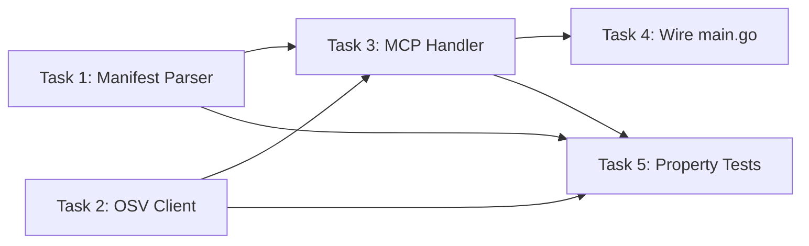

**File:** `.kiro/specs/vulnscanner/tasks.md`
**Module:** `internal/vulnscanner/`
**Tool:** `vulnscanner/scan`

# Implementation Tasks: Vuln-Scanner Module

## Overview

This plan builds incrementally: manifest parser first, then OSV client, then MCP handler with LLM enrichment, wiring, and finally property-based tests. Each task references its requirements and produces testable output. All mocks are hand-written structs in `_test.go` files — no third-party mocking libraries.

**Implementation status:** All 5 tasks are **pending** — execute them in order. If `internal/vulnscanner/` already has reference implementations, you MAY skip completed tasks; otherwise implement from scratch.

---

## Tasks

### Task 1: Implement manifest parser (`parser.go`)

- **Req:** REQ-VS-1
- **Files:** `internal/vulnscanner/parser.go`, `internal/vulnscanner/parser_test.go`
- **Goal:** Parse npm (`package.json`, `package-lock.json` v1/v2/v3) and pip (`requirements.txt`) manifests into a uniform `[]Dependency` slice.

#### Step-by-step

1. **Create `internal/vulnscanner/parser.go`** with:
   - `Dependency` struct: `Name`, `Version`, `Ecosystem` — all with `json` tags
   - `ParseManifest(content, ecosystem string) ([]Dependency, error)` — dispatches to `parseNPM` or `parsePip` based on ecosystem
   - `parseNPM(content string) ([]Dependency, error)` — unmarshal JSON, extract:
     - `"dependencies"` and `"devDependencies"` maps (string→string, strip semver prefixes via `stripVersionPrefix`)
     - `"packages"` map (package-lock v3 format, keyed by `node_modules/<name>`), extract name via `extractPackageName`; skip entries with empty key `""` (represents the root project, not a dependency)
     - Legacy `"dependencies"` map (package-lock v1/v2, keyed by name with version objects) — only if no standard deps were found
   - `parsePip(content string) ([]Dependency, error)` — split by newline, for each non-empty non-comment non-flag line call `parsePipLine`
   - `parsePipLine(line string) (name, version string)` — try two-char operators first (`==`, `>=`, `<=`, `!=`, `~=`), fall back to bare name
   - `stripVersionPrefix(version string) string` — strip `>=`, `<=`, `~>`, `^`, `~`, `>`, `<`, `=`
   - `extractPackageName(path string) string` — extract from `node_modules/...` path, handling scoped packages (`@scope/pkg`)

2. **Write tests in `parser_test.go`:**
   - `TestParseManifest_NPM_DependenciesAndDevDependencies` — full package.json with 4 deps, verify versions stripped and sorted
   - `TestParseManifest_NPM_VersionPrefixStripping` — all prefix types (`^`, `~`, `>=`, `<=`, `>`, `<`, `=`, none)
   - `TestParseManifest_NPM_PackageLockFormat` — v3 lock format with `packages` (including scoped `@types/node`)
   - `TestParseManifest_NPM_LegacyLockFormat` — v1 lock format with legacy `dependencies`
   - `TestParseManifest_NPM_InvalidJSON` — malformed JSON → error
   - `TestParseManifest_NPM_EmptyManifest` — empty JSON object `{}` → 0 deps, no error
   - `TestParseManifest_Pip_ValidRequirements` — 4 deps with `==` and `>=`, verify sorted
   - `TestParseManifest_Pip_CommentsAndEmptyLines` — comments (`#`), blank lines skipped
   - `TestParseManifest_Pip_FlagsIgnored` — lines starting with `-` skipped
   - `TestParseManifest_Pip_NoVersionConstraint` — bare package names → version = `""`
   - `TestParseManifest_Pip_AllOperators` — `==`, `>=`, `<=`, `!=`, `~=`
   - `TestParseManifest_Pip_EmptyManifest` — empty string → 0 deps
   - `TestParseManifest_Pip_InlineComments` — `pkg==1.0 # comment` → strips comment
   - `TestParseManifest_UnsupportedEcosystem` — `"cargo"` → error

3. **Verify:** `go test -v -count=1 ./internal/vulnscanner/ -run TestParseManifest`

#### Expected Output

All 14 tests pass.

---

### Task 2: Implement OSV.dev client (`osv.go`)

- **Req:** REQ-VS-2
- **Files:** `internal/vulnscanner/osv.go`, `internal/vulnscanner/osv_test.go`
- **Goal:** Query OSV.dev batch API with all dependencies and return structured vulnerability data.

#### Step-by-step

1. **Create `internal/vulnscanner/osv.go`** with:
   - API types: `OSVVulnerability`, `OSVSeverity`, `OSVAffected`, `OSVPackage`, `OSVRange`, `OSVEvent` — matching the OSV.dev JSON schema
   - Internal request/response types: `osvQueryBatchRequest`, `osvQuery`, `osvQueryBatchResponse`, `osvQueryResult`
   - `OSVClient` struct with `httpClient` and `baseURL` fields
   - `NewOSVClient() *OSVClient` — default URL: `https://api.osv.dev`
   - `NewOSVClientWithURL(baseURL string) *OSVClient` — for testing with `httptest.NewServer`
   - `QueryBatch(ctx, deps []Dependency) (map[string][]OSVVulnerability, error)`:
     - Enforce 30s timeout via `context.WithTimeout(ctx, osvBatchTimeout)`
     - Marshal `osvQueryBatchRequest` with one query per dependency
     - POST to `{baseURL}/v1/querybatch` with `Content-Type: application/json`
     - Decode response, validate HTTP 200
     - Map results back to dependencies by index position

2. **Write tests in `osv_test.go`:**
   - `TestQueryBatch_Success` — mock server with 2 deps (1 vulnerable, 1 clean), verify request validation (method, path, content-type, body structure)
   - `TestQueryBatch_EmptyResults` — 2 deps, no vulns for either
   - `TestQueryBatch_EmptyDependencies` — empty deps slice → empty map, no HTTP call
   - `TestQueryBatch_APIErrorStatus` — server returns 500 → error with expected message
   - `TestQueryBatch_Timeout` — slow server (2s delay) with 100ms parent context → timeout error
   - `TestQueryBatch_MultipleDependencies` — 5 deps with mixed results (pkg-a: 1 vuln, pkg-b: 0, pkg-c: 2, pkg-d: 0, pkg-e: 1)
   - `TestNewOSVClient_DefaultURL` — verify default URL
   - `TestNewOSVClientWithURL_CustomURL` — verify custom URL

3. **Verify:** `go test -v -count=1 ./internal/vulnscanner/ -run TestQueryBatch|TestNewOSVClient`

---

### Task 3: Implement MCP handler (`handler.go`)

- **Req:** REQ-VS-3, REQ-VS-4, REQ-VS-5, REQ-VS-6
- **Files:** `internal/vulnscanner/handler.go`, `internal/vulnscanner/handler_test.go`
- **Goal:** Wire parser → OSV → async LLM enrichment with async notification pattern matching Clean-Arch module.

#### Step-by-step

1. **Create `internal/vulnscanner/handler.go`** with:

   **Types:**
   - `VulnFinding` struct: `PackageName`, `CVEID`, `Severity`, `AffectedRange`, `FixedVersion`, `Explanation` — json tags
   - `VulnScannerInput` struct: `Manifest`, `Ecosystem` — json tags
   - `VulnScannerOutput` struct: `Findings`, `TotalDeps`, `VulnCount`, `ScanError`, `RequestID` — json tags (RequestID correlates async enrichment)
   - `FindingEnrichment` struct: `RequestID`, `FindingIndex`, `PackageName`, `CVEID`, `AIExplanation` — json tags (async notification payload)
   - `VulnScannerHandler` struct with:
     - `osvClient *OSVClient`
     - `llm llm.LLMBackend` (may be nil)
     - `notifier rpc.Notifier` (may be nil)
     - `baseCtx context.Context` / `baseCancel context.CancelFunc` (for lifecycle)
     - `inflight sync.WaitGroup` (tracks background goroutines for shutdown)
     - `globalSem chan struct{}` (bounds concurrent LLM calls)
     - `enrichTimeout time.Duration` (default: 1.5s per LLM call)
     - `maxPerRequest int` (default: 5)
     - `logger *slog.Logger`

   **Constructor & lifecycle:**
   - `NewVulnScannerHandler(osvClient, llmBackend)` — base constructor
   - `SetNotifier(n rpc.Notifier)` — wires transport, called once at startup
   - `Shutdown()` — cancels baseCtx, waits for inflight goroutines

   **`Handle(ctx, params)`:**
   1. Parse + validate params (manifest + ecosystem required; reject manifest > 5MB with -32602)
   2. Parse manifest → `[]Dependency`
   3. Query OSV → vulnerability map
   4. On OSV error: set `ScanError`, return partial output
   5. Map vulns to `[]VulnFinding` via `mapOSVToFinding`
   6. Sort findings by `severity_score` descending, cap to `maxPerRequest`
   7. If `llm != nil && notifier != nil`, generate `requestID`, call `startBackgroundEnrichment()`, set `RequestID` in output
   8. Return `VulnScannerOutput` immediately (explanations are empty; they arrive asynchronously)

   **Mapping helpers (same as before):**
   - `mapOSVToFinding(pkgName, vuln) VulnFinding`
   - `parseSeverityScore(severities []OSVSeverity) float64`
   - `extractCVSSScore(vector string) float64`
   - `estimateFromCVSSVector(vector string) float64`
   - `buildRangeInfo(events []OSVEvent) (affectedRange, fixedVersion string)`

   **Async enrichment:**
   - `startBackgroundEnrichment(clientID, requestID string, findings []VulnFinding)` — runs on detached `baseCtx` (re-tagged with clientID via `rpc.WithClientID`); acquires semaphore slot per finding; calls `LLMBackend.Complete()`; on success calls `emitEnrichment`
   - `emitEnrichment(ctx, requestID string, idx int, f VulnFinding)` — pushes `notifications/message` notification with `FindingEnrichment` payload via `notifier.Send()`
   - `buildPrompt(f VulnFinding) llm.Prompt` — builds prompt using ONLY `CVEID`, `PackageName`, `Severity`, `AffectedRange`, `FixedVersion` — no raw OSV JSON

   **Registration:**
   - `RegisterVulnScanner(d, handler)` — registers `"vulnscanner/scan"`

2. **Write tests in `handler_test.go`:**
   - Create hand-written `mockLLMBackend` and `mockNotifier` structs (do NOT use gomock/testify)
   - `TestHandle_ValidScanWithVulnerabilities` — mock OSV returns vuln → verify finding fields (CVEID, severity, affected range, fixed version)
   - `TestHandle_ValidScanNoVulnerabilities` — mock OSV returns empty → 0 findings
   - `TestHandle_InvalidParams` — table-driven: invalid JSON, empty manifest, empty ecosystem
   - `TestHandle_ManifestTooLarge` — manifest string >5MB → -32602 error
   - `TestHandle_OSVErrorCapturedInScanError` — mock server returns 500 → ScanError populated, TotalDeps still set
   - `TestHandle_NoNotifierNoEnrichment` — LLM available but notifier is nil → findings returned immediately without enrichment, no background goroutines
   - `TestHandle_AsyncEnrichmentNotifications` — mock OSV + mock LLM + mock notifier → initial response has request_id and empty explanations; mock notifier captures exactly 5 `FindingEnrichment` notifications; verify notification payload fields (request_id matches, finding_index sequential, ai_explanation non-empty)
   - `TestHandle_AsyncNotificationErrorDropped` — mock OSV + mock LLM that returns error + mock notifier → initial response delivered; zero notifications fired
   - `TestRegisterVulnScanner` — register handler, dispatch request → method not unknown error
   - `TestMapOSVToFinding_MultipleRanges` — verify mapping of OSV fields to finding
   - `TestParseSeverityScore` — table-driven: empty, direct numeric, CVSS vector, empty string

3. **Verify:** `go test -v -count=1 ./internal/vulnscanner/ -run 'TestHandle|TestRegisterVulnScanner|TestMapOSV|TestParseSeverity'` (should show 12+ tests)

---

### Task 4: Wire module into main.go

- **Req:** REQ-VS-6
- **File:** `main.go`
- **Goal:** Register Vuln-Scanner tool so it's available to MCP clients.

#### Step-by-step

1. **In `main.go`, after Env-Guard registration:**
   ```go
   // Vuln-Scanner: dependency vulnerability scanning.
   osvClient := vulnscanner.NewOSVClient()
   vulnHandler := vulnscanner.NewVulnScannerHandler(osvClient, llmBackend)
   vulnscanner.RegisterVulnScanner(dispatcher, vulnHandler)
   ```

2. **Verify:**
   - Build: `go build -o /dev/null .`
   - Smoke test: `echo '{"jsonrpc":"2.0","id":1,"method":"vulnscanner/scan","params":{"manifest":"{\"dependencies\":{\"lodash\":\"4.17.20\"}}","ecosystem":"npm"}}' | go run . 2>/dev/null`
   - Expected: JSON-RPC response with findings array (may be empty if network is unavailable → `scan_error` set)

---

### Task 5: Write property-based tests

- **Req:** REQ-VS-1, REQ-VS-3, REQ-VS-4, REQ-VS-5
- **Files:** `internal/vulnscanner/parser_pbt_test.go`, `internal/vulnscanner/findings_pbt_test.go`
- **Goal:** Validate universal correctness properties using `pgregory.net/rapid`.

#### Property 8: Manifest Parsing Completeness

```go
// Feature: vulnscanner, Property 8: Manifest parsing completeness
// For any valid package.json or requirements.txt, every dependency appears in the output.
func TestProperty_ManifestParsingCompleteness(t *testing.T) {
    rapid.Check(t, func(t *rapid.T) {
        // Generate random package.json / requirements.txt with known deps
        // Verify ParseManifest returns all of them
    })
}
```

#### Property 9: Vulnerability Response Structure

```go
// Feature: vulnscanner, Property 9: Vulnerability response structure
// Every non-empty OSV vuln maps to a finding with required fields populated.
func TestProperty_VulnFindingStructure(t *testing.T) {
    rapid.Check(t, func(t *rapid.T) {
        // Generate random OSV vulnerabilities
        // Verify mapOSVToFinding produces valid VulnFinding with non-empty CVEID
    })
}
```

#### Property 13: OSV Error Resilience

```go
// Feature: vulnscanner, Property 13: OSV error resilience
// Any OSV API failure returns partial output, never a hard error.
func TestProperty_OSVErrorResilience(t *testing.T) {
    rapid.Check(t, func(t *rapid.T) {
        // Generate random HTTP error scenarios
        // Verify handler returns output with ScanError, not an RPC error
    })
}
```

---

## Task Dependency Graph



## Verification Checklist

- [ ] `go test -v -count=1 ./internal/vulnscanner/` — all unit tests pass (currently 30+ tests)
- [ ] `go test -race -count=1 ./internal/vulnscanner/` — no data races
- [ ] `go build ./...` — compiles without errors
- [ ] Manual smoke test with real OSV.dev: `echo '{"jsonrpc":"2.0","id":1,"method":"vulnscanner/scan","params":{"manifest":"{\"dependencies\":{\"lodash\":\"4.17.20\"}}","ecosystem":"npm"}}' | go run . 2>/dev/null`
- [ ] OSV outage simulation: verify `scan_error` is set in response
- [ ] Async enrichment: initial response has `request_id` and empty explanations; notifications arrive in SSE stream
- [ ] SSE session test: open SSE connection, submit scan → verify enrichment notifications appear in event stream
