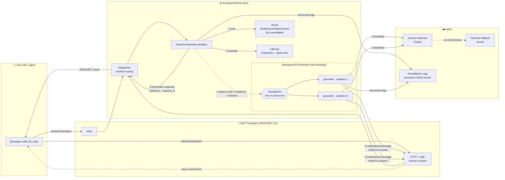

# Clean-Arch — AI-Powered Architecture Linting for KiroGuard

> An MCP tool (`cleanarch/analyze`) that stops architectural decay before it reaches production — read-only, deterministic, and enriched on demand by Amazon Bedrock.

---

## Executive Summary

Architectural erosion is silent, compounding technical debt: every time a domain package quietly imports infrastructure, future change gets slower and more expensive. **Clean-Arch** turns that invisible decay into an automated, pre-merge guardrail. It performs read-only AST analysis of a Go codebase, deterministically flags layer violations (zero false positives from the rule engine), and — only when a violation is actually found — calls **Amazon Bedrock (Claude)** to explain the issue and propose a fix. Delivered as an **MCP serverless-friendly service** (JSON-RPC over stdio or HTTP+SSE, no always-on web framework), it drives down cost on two fronts: it **reduces engineering spend** by catching debt at authoring time instead of in expensive refactors, and it **optimizes AI/LLM cost (FinOps)** by invoking the model surgically — never on clean code, never inline, and always under strict concurrency and timeout budgets. The result: healthier architecture, faster reviews, and a predictable, minimal AI bill.

---

## AWS Well-Architected Framework Alignment

Clean-Arch was designed against three pillars of the [AWS Well-Architected Framework](https://aws.amazon.com/architecture/well-architected/):

### Reliability
- **Graceful Bedrock fallback:** a router tries Amazon Bedrock first and falls back to a local heuristic provider on any error; a failed or timed-out enrichment never fails the analysis — the deterministic violations are always returned.
- **Concurrency control:** background enrichment is bounded by a semaphore (max 5 in-flight LLM calls), preventing thread/connection exhaustion and Bedrock throttling under large violation sets.
- **Blast-radius isolation:** enrichment runs on a detached context so a slow model can never stall or crash the request path.

### Performance Efficiency
- **Non-blocking response:** `Handle` returns the AST findings immediately; LLM work happens in background goroutines and is streamed back as JSON-RPC notifications.
- **Bounded latency everywhere:** a cancellable scan (3s deadline, partial results on expiry) plus a per-call enrichment deadline (1.5s) keep tail latency predictable.
- **Lightweight parsing:** `go/parser` in `ImportsOnly` mode — no full type-checking, no external services on the hot path.

### Cost Optimization
- **Surgical LLM usage:** Bedrock is invoked **only** when a violation exists, **only** when a client session can receive the result, and **at most once per violation**. Clean code costs $0 in model spend.
- **Right-sized calls:** structured JSON output and capped token budgets keep each invocation small and predictable.
- **Serverless-friendly footprint:** stdio/SSE JSON-RPC with no persistent web tier — scales to zero between requests.

---

## Production Architecture



**Flow in words:** Kiro sends `cleanarch/analyze` over JSON-RPC → the Go dispatcher routes it to `CleanArchHandler` → a cancellable AST scan builds the import graph and the rule engine flags violations → the handler **returns immediately** with the violations and a `request_id`. If (and only if) violations exist and the caller has an SSE session, enrichment goroutines — throttled by a **max-5 semaphore** — call **Bedrock**, and each result is pushed back as a **session-routed `notifications/message`** carrying the same `request_id`.

---

## Observability (CloudWatch-ready)

Clean-Arch emits structured JSON logs (via the shared `internal/logging` logger, `--log-format json`) tagged with `"module":"clean-arch"`, designed for CloudWatch Logs Insights filtering:

| Event | Emitted when | Key fields |
|---|---|---|
| `scan_started` | analysis begins | `target` (directory) |
| `llm_fallback_triggered` | a Bedrock enrichment errors, times out, or returns non-JSON | `reason` |
| `scan_completed` | the synchronous analysis returns | `violations_found`, `latency_ms` |

Example CloudWatch Logs Insights query:

```
fields @timestamp, event, violations_found, latency_ms
| filter module = "clean-arch" and event = "scan_completed"
| sort latency_ms desc
```

---

## Guardrails (Read-Only by Design)

Clean-Arch **never mutates source code** — a critical hallucination-mitigation property for an AI tool. It only reads files (`go/parser`, `os.ReadFile`) and returns warnings; suggested fixes are advisory text (`suggested_fix_diff`), never applied to disk. This invariant is enforced by a property-based test (source-immutability) that hashes every file before and after analysis.

---

## Tool Contract (quick reference)

**Request** — `cleanarch/analyze`
```json
{ "directory_path": "./internal", "rules_file": ".cleanarch.yaml" }
```

**Immediate response**
```json
{ "violations": [ ... ], "total_edges": 27, "message": "...", "request_id": "a1b2c3d4" }
```

**Async enrichment** — `notifications/message` (routed to the caller's SSE session)
```json
{
  "level": "info",
  "logger": "cleanarch/analyze",
  "data": {
    "request_id": "a1b2c3d4",
    "violation_index": 0,
    "file_path": "internal/domain/service.go",
    "import": "internal/infrastructure/db",
    "ai_explanation": "Domain must not depend on infrastructure...",
    "suggested_fix_diff": "..."
  }
}
```

See [`.kiro/specs/clean-arch/design.md`](../../.kiro/specs/clean-arch/design.md) for the full design and sequence diagrams.
